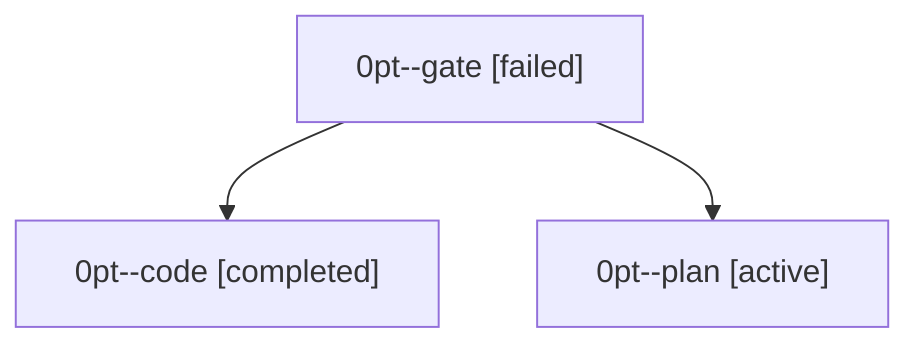

# Family: 0pt

[Agent Hoods](../README.md) / [bbugyi200](../users/bbugyi200/README.md) / [athena](../users/bbugyi200/machines/athena/README.md) / [0pt](../users/bbugyi200/machines/athena/hoods/0pt/README.md) / 0pt

Owner: `bbugyi200.athena` · Hood: `0pt` · Members: 3

## Lineage

The diagram is an optional enhancement; the ordered table below contains the same lineage in accessible text.

| Role | Agent | State | Model / provider | Timing | Commits | Prompt | Chat |
|---|---|---|---|---|---:|---|---|
| gate | 0pt--gate | failed | opus / claude | 2026-09-23T13:33:33.550668+00:00 → 2026-09-23T13:34:30.884230+00:00 | 0 | — | [Chat](../agents/bbugyi200.athena.0pt--gate/chat.md) |
| code | 0pt--code | completed | muse-spark-1.3-contributor / muse | 2026-09-23T13:34:54.720394+00:00 → 2026-09-23T13:59:41.049193+00:00 | [1](../agents/bbugyi200.athena.0pt--code/README.md#commits) | [Prompt](../agents/bbugyi200.athena.0pt--code/prompt.md) | [Chat](../agents/bbugyi200.athena.0pt--code/chat.md) |
| plan | 0pt--plan | active | opus / claude | 2026-09-23T13:30:28.516005+00:00 | 0 | [Prompt](../agents/bbugyi200.athena.0pt--plan/prompt.md) | [Chat](../agents/bbugyi200.athena.0pt--plan/chat.md) |

## Commits

| Role | Repo | Commit | Subject | Committed |
|---|---|---|---|---|
| code | sase | [`07d1c0e`](https://github.com/sase-org/sase/commit/07d1c0e7b2f951ba363d6dee1e3315948611c9e8) | feat(ace): hide idle dispatch Target/Source context line without %dispatch | 2026-09-23 09:55:08 EDT |
