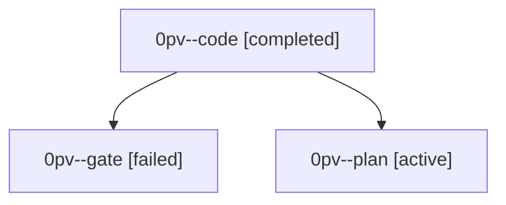

# Family: 0pv

[Agent Hoods](../README.md) / [bbugyi200](../users/bbugyi200/README.md) / [athena](../users/bbugyi200/machines/athena/README.md) / [0pv](../users/bbugyi200/machines/athena/hoods/0pv/README.md) / 0pv

Owner: `bbugyi200.athena` · Hood: `0pv` · Members: 3

## Lineage

The diagram is an optional enhancement; the ordered table below contains the same lineage in accessible text.

| Role | Agent | State | Model / provider | Timing | Commits | Prompt | Chat |
|---|---|---|---|---|---:|---|---|
| code | 0pv--code | completed | muse-spark-1.3-contributor / muse | 2026-09-23T13:55:53.540905+00:00 → 2026-09-23T14:17:05.310715+00:00 | [1](../agents/bbugyi200.athena.0pv--code/README.md#commits) | [Prompt](../agents/bbugyi200.athena.0pv--code/prompt.md) | [Chat](../agents/bbugyi200.athena.0pv--code/chat.md) |
| gate | 0pv--gate | failed | opus / claude | 2026-09-23T13:50:30.581079+00:00 → 2026-09-23T13:52:12.384138+00:00 | 0 | — | [Chat](../agents/bbugyi200.athena.0pv--gate/chat.md) |
| plan | 0pv--plan | active | opus / claude | 2026-09-23T13:36:46.836148+00:00 | 0 | [Prompt](../agents/bbugyi200.athena.0pv--plan/prompt.md) | [Chat](../agents/bbugyi200.athena.0pv--plan/chat.md) |

## Commits

| Role | Repo | Commit | Subject | Committed |
|---|---|---|---|---|
| code | sase | [`4f1177f`](https://github.com/sase-org/sase/commit/4f1177f2c58d07e8100c932903a54bdae6807d03) | fix(agents): collapse Enter on tale-plan family to its single tale gate | 2026-09-23 10:13:56 EDT |
