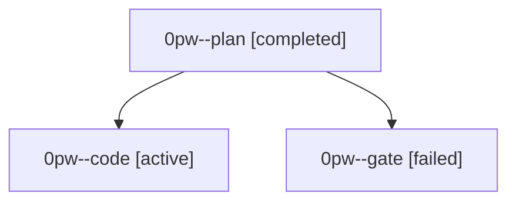

# Family: 0pw

[Agent Hoods](../README.md) / [bbugyi200](../users/bbugyi200/README.md) / [athena](../users/bbugyi200/machines/athena/README.md) / [0pw](../users/bbugyi200/machines/athena/hoods/0pw/README.md) / 0pw

Owner: `bbugyi200.athena` · Hood: `0pw` · Members: 3

## Lineage

The diagram is an optional enhancement; the ordered table below contains the same lineage in accessible text.

| Role | Agent | State | Model / provider | Timing | Commits | Prompt | Chat |
|---|---|---|---|---|---:|---|---|
| plan | 0pw--plan | completed | opus / claude | 2026-09-23T13:41:30.427915+00:00 → 2026-09-23T13:59:23.298059+00:00 | 0 | [Prompt](../agents/bbugyi200.athena.0pw--plan/prompt.md) | [Chat](../agents/bbugyi200.athena.0pw--plan/chat.md) |
| code | 0pw--code | active | muse-spark-1.3-contributor / muse | 2026-09-23T14:01:25.524741+00:00 | [1](../agents/bbugyi200.athena.0pw--code/README.md#commits) | [Prompt](../agents/bbugyi200.athena.0pw--code/prompt.md) | — |
| gate | 0pw--gate | failed | opus / claude | 2026-09-23T13:59:48.785121+00:00 → 2026-09-23T14:01:02.577247+00:00 | 0 | — | [Chat](../agents/bbugyi200.athena.0pw--gate/chat.md) |

## Commits

| Role | Repo | Commit | Subject | Committed |
|---|---|---|---|---|
| code | sase | [`c6c70be`](https://github.com/sase-org/sase/commit/c6c70befc7b2a3d835eb7036dbc4ab48f5c8ef45) | feat(ace): add tribe panel PROMPTS intent map | 2026-09-23 10:56:46 EDT |
