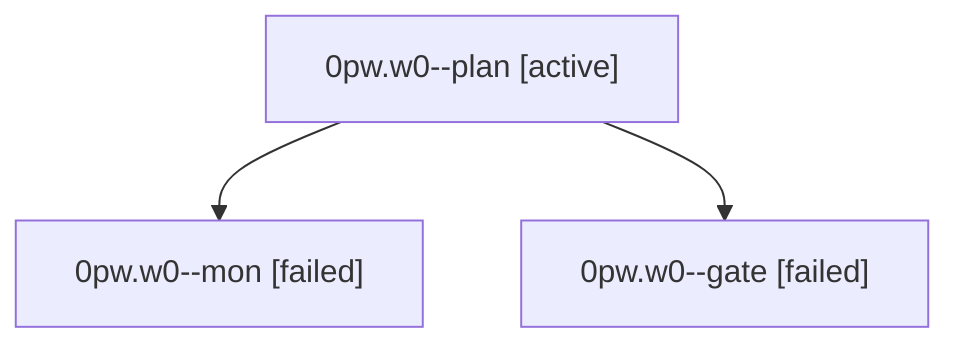

# Family: 0pw.w0

[Agent Hoods](../README.md) / [bbugyi200](../users/bbugyi200/README.md) / [athena](../users/bbugyi200/machines/athena/README.md) / [0pw](../users/bbugyi200/machines/athena/hoods/0pw/README.md) / 0pw.w0

Owner: `bbugyi200.athena` · Hood: `0pw` · Members: 3

## Lineage

The diagram is an optional enhancement; the ordered table below contains the same lineage in accessible text.

| Role | Agent | State | Model / provider | Timing | Commits | Prompt | Chat |
|---|---|---|---|---|---:|---|---|
| plan | 0pw.w0--plan | active | opus / claude | 2026-09-23T15:05:12.117469+00:00 | 0 | [Prompt](../agents/bbugyi200.athena.0pw.w0--plan/prompt.md) | [Chat](../agents/bbugyi200.athena.0pw.w0--plan/chat.md) |
| mon | 0pw.w0--mon | failed | opus / claude | 2026-09-23T15:38:29.666646+00:00 → 2026-09-23T15:38:51.018601+00:00 | 0 | — | [Chat](../agents/bbugyi200.athena.0pw.w0--mon/chat.md) |
| gate | 0pw.w0--gate | failed | opus / claude | 2026-09-23T15:35:24.287566+00:00 → 2026-09-23T15:38:47.897714+00:00 | 0 | — | [Chat](../agents/bbugyi200.athena.0pw.w0--gate/chat.md) |

## Neighbors

| Agent | Relation | State |
|---|---|---|
| [0pw](bbugyi200.athena.0pw.md) (family · 3) | ancestor | active 1, completed 1, failed 1 |
