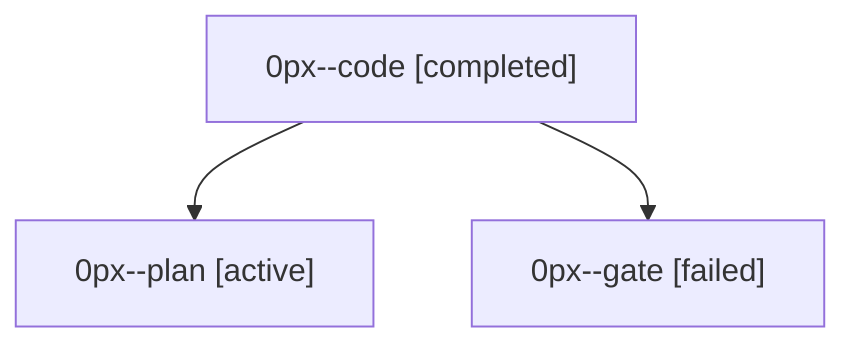

# Family: 0px

[Agent Hoods](../README.md) / [bbugyi200](../users/bbugyi200/README.md) / [athena](../users/bbugyi200/machines/athena/README.md) / [0px](../users/bbugyi200/machines/athena/hoods/0px/README.md) / 0px

Owner: `bbugyi200.athena` · Hood: `0px` · Members: 3

## Lineage

The diagram is an optional enhancement; the ordered table below contains the same lineage in accessible text.

| Role | Agent | State | Model / provider | Timing | Commits | Prompt | Chat |
|---|---|---|---|---|---:|---|---|
| code | 0px--code | completed | muse-spark-1.3-contributor / muse | 2026-09-23T13:58:29.294515+00:00 → 2026-09-23T14:15:09.875548+00:00 | [1](../agents/bbugyi200.athena.0px--code/README.md#commits) | [Prompt](../agents/bbugyi200.athena.0px--code/prompt.md) | [Chat](../agents/bbugyi200.athena.0px--code/chat.md) |
| plan | 0px--plan | active | opus / claude | 2026-09-23T13:51:01.111789+00:00 | 0 | [Prompt](../agents/bbugyi200.athena.0px--plan/prompt.md) | [Chat](../agents/bbugyi200.athena.0px--plan/chat.md) |
| gate | 0px--gate | failed | opus / claude | 2026-09-23T13:55:27.290568+00:00 → 2026-09-23T13:57:10.731379+00:00 | 0 | — | [Chat](../agents/bbugyi200.athena.0px--gate/chat.md) |

## Commits

| Role | Repo | Commit | Subject | Committed |
|---|---|---|---|---|
| code | sase | [`b3e31bb`](https://github.com/sase-org/sase/commit/b3e31bb592da4cc2f7d5e957cfab2e307eaee08b) | feat(history): seed Ctrl+K project scope from +project tags | 2026-09-23 10:10:14 EDT |
