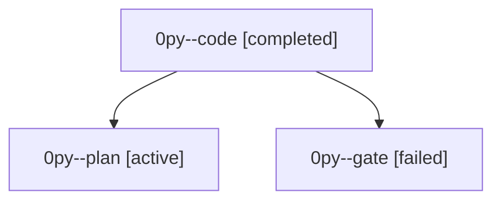

# Family: 0py

[Agent Hoods](../README.md) / [bbugyi200](../users/bbugyi200/README.md) / [athena](../users/bbugyi200/machines/athena/README.md) / [0py](../users/bbugyi200/machines/athena/hoods/0py/README.md) / 0py

Owner: `bbugyi200.athena` · Hood: `0py` · Members: 3

## Lineage

The diagram is an optional enhancement; the ordered table below contains the same lineage in accessible text.

| Role | Agent | State | Model / provider | Timing | Commits | Prompt | Chat |
|---|---|---|---|---|---:|---|---|
| code | 0py--code | completed | muse-spark-1.3-contributor / muse | 2026-09-23T14:30:24.710756+00:00 → 2026-09-23T14:49:13.490505+00:00 | [1](../agents/bbugyi200.athena.0py--code/README.md#commits) | [Prompt](../agents/bbugyi200.athena.0py--code/prompt.md) | [Chat](../agents/bbugyi200.athena.0py--code/chat.md) |
| plan | 0py--plan | active | opus / claude | 2026-09-23T14:05:58.940114+00:00 | 0 | [Prompt](../agents/bbugyi200.athena.0py--plan/prompt.md) | [Chat](../agents/bbugyi200.athena.0py--plan/chat.md) |
| gate | 0py--gate | failed | opus / claude | 2026-09-23T14:28:58.953760+00:00 → 2026-09-23T14:29:52.025728+00:00 | 0 | — | [Chat](../agents/bbugyi200.athena.0py--gate/chat.md) |

## Commits

| Role | Repo | Commit | Subject | Committed |
|---|---|---|---|---|
| code | sase | [`77f869c`](https://github.com/sase-org/sase/commit/77f869cb18d74f4fd712e79f4f882a07e45ea5ec) | feat(lease): retry transient git fetch failures during operational lease preparation | 2026-09-23 10:46:33 EDT |
