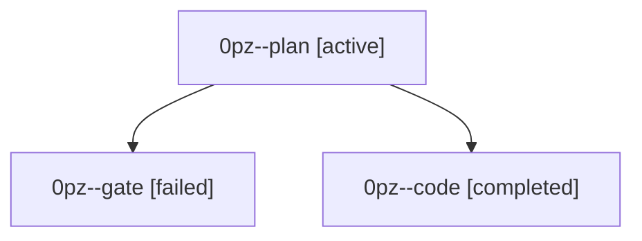

# Family: 0pz

[Agent Hoods](../README.md) / [bbugyi200](../users/bbugyi200/README.md) / [athena](../users/bbugyi200/machines/athena/README.md) / [0pz](../users/bbugyi200/machines/athena/hoods/0pz/README.md) / 0pz

Owner: `bbugyi200.athena` · Hood: `0pz` · Members: 3

## Lineage

The diagram is an optional enhancement; the ordered table below contains the same lineage in accessible text.

| Role | Agent | State | Model / provider | Timing | Commits | Prompt | Chat |
|---|---|---|---|---|---:|---|---|
| plan | 0pz--plan | active | opus / claude | 2026-09-23T14:10:46.641914+00:00 | 0 | [Prompt](../agents/bbugyi200.athena.0pz--plan/prompt.md) | [Chat](../agents/bbugyi200.athena.0pz--plan/chat.md) |
| gate | 0pz--gate | failed | opus / claude | 2026-09-23T14:13:47.545044+00:00 → 2026-09-23T14:16:18.554338+00:00 | 0 | — | [Chat](../agents/bbugyi200.athena.0pz--gate/chat.md) |
| code | 0pz--code | completed | muse-spark-1.3-contributor / muse | 2026-09-23T14:16:42.712329+00:00 → 2026-09-23T14:34:01.090318+00:00 | [1](../agents/bbugyi200.athena.0pz--code/README.md#commits) | [Prompt](../agents/bbugyi200.athena.0pz--code/prompt.md) | [Chat](../agents/bbugyi200.athena.0pz--code/chat.md) |

## Commits

| Role | Repo | Commit | Subject | Committed |
|---|---|---|---|---|
| code | sase | [`abfd74d`](https://github.com/sase-org/sase/commit/abfd74d17320f24468a4912b8e57569185328755) | feat(ace): keep prompt stash panel open after partial delete | 2026-09-23 10:33:06 EDT |
