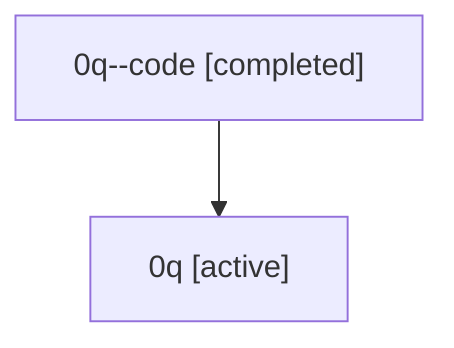

# Family: 0q

[Agent Hoods](../README.md) / [bbugyi200](../users/bbugyi200/README.md) / [athena](../users/bbugyi200/machines/athena/README.md) / [0q](../users/bbugyi200/machines/athena/hoods/0q/README.md) / 0q

Owner: `bbugyi200.athena` · Hood: `0q` · Members: 2

## Lineage

The diagram is an optional enhancement; the ordered table below contains the same lineage in accessible text.

| Role | Agent | State | Model / provider | Timing | Commits | Prompt | Chat |
|---|---|---|---|---|---:|---|---|
| code | 0q--code | completed | gpt-5.5 / codex | 2026-07-07T18:02:22.608190+00:00 | [1](../agents/bbugyi200.athena.0q--code/README.md#commits) | — | [Chat](../agents/bbugyi200.athena.0q--code/chat.md) |
| root | 0q | active | gpt-5.5 / codex | 2026-07-07T17:57:32.430106+00:00 | [4](../agents/bbugyi200.athena.0q/README.md#commits) | [Prompt](../agents/bbugyi200.athena.0q/prompt.md) | [Chat](../agents/bbugyi200.athena.0q/chat.md) |

## Commits

| Role | Repo | Commit | Subject | Committed (UTC) |
|---|---|---|---|---|
| root | sase | [`ca2e170`](https://github.com/sase-org/sase/commit/ca2e170b7cfa4807c33ad3b185a3aeac4750ac0e) | chore: Add SDD prompt and plan for workflow\_variables | 2026-06-03 03:13:16 |
| root | sase | [`46aa1d2`](https://github.com/sase-org/sase/commit/46aa1d2ec3ef74a84a72827595a1d2dc2716ac68) | feat: rename step metadata section to workflow variables | 2026-06-03 03:18:28 |
| root | sase | [`84f07fe`](https://github.com/sase-org/sase/commit/84f07fe342964797ad4066461d1753c6afc5fe7d) | chore: Add SDD prompt and plan for linked\_repo\_pencil\_badge | 2026-07-07 18:02:21 |
| code | sase | [`c962280`](https://github.com/sase-org/sase/commit/c962280a98dd9bcbae75f7d8e91cb7d099501bb3) | feat(tui): show linked repo change badges | 2026-07-07 18:21:27 |
| root | sase | [`c962280`](https://github.com/sase-org/sase/commit/c962280a98dd9bcbae75f7d8e91cb7d099501bb3) | feat(tui): show linked repo change badges | 2026-07-07 18:21:27 |
