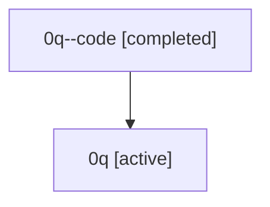

# Family: 0q

Owner: `bbugyi200.athena` · Hood: `0q` · Members: 2

## Lineage

The diagram is an optional enhancement; the ordered table below contains the same lineage in accessible text.

| Role | Agent | State | Model / provider | Timing | Commits | Prompt | Chat |
|---|---|---|---|---|---:|---|---|
| code | 0q--code | completed | gpt-5.5 / codex | 2026-07-07T18:02:22.608190+00:00 | 1 | — | [Chat](../agents/bbugyi200.athena.0q--code/chat.md) |
| root | 0q | active | gpt-5.5 / codex | 2026-07-07T17:57:32.430106+00:00 | 4 | [Prompt](../agents/bbugyi200.athena.0q/prompt.md) | [Chat](../agents/bbugyi200.athena.0q/chat.md) |
