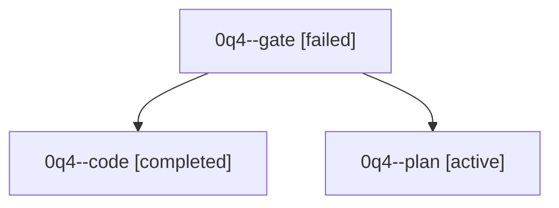

# Family: 0q4

[Agent Hoods](../README.md) / [bbugyi200](../users/bbugyi200/README.md) / [athena](../users/bbugyi200/machines/athena/README.md) / [0q4](../users/bbugyi200/machines/athena/hoods/0q4/README.md) / 0q4

Owner: `bbugyi200.athena` · Hood: `0q4` · Members: 3

## Lineage

The diagram is an optional enhancement; the ordered table below contains the same lineage in accessible text.

| Role | Agent | State | Model / provider | Timing | Commits | Prompt | Chat |
|---|---|---|---|---|---:|---|---|
| gate | 0q4--gate | failed | opus / claude | 2026-09-23T15:32:38.319138+00:00 → 2026-09-23T15:36:55.173821+00:00 | 0 | — | [Chat](../agents/bbugyi200.athena.0q4--gate/chat.md) |
| code | 0q4--code | completed | muse-spark-1.3-contributor / muse | 2026-09-23T15:46:24.007276+00:00 → 2026-09-23T16:52:52.954433+00:00 | [1](../agents/bbugyi200.athena.0q4--code/README.md#commits) | [Prompt](../agents/bbugyi200.athena.0q4--code/prompt.md) | [Chat](../agents/bbugyi200.athena.0q4--code/chat.md) |
| plan | 0q4--plan | active | opus / claude | 2026-09-23T15:20:19.650915+00:00 | 0 | [Prompt](../agents/bbugyi200.athena.0q4--plan/prompt.md) | [Chat](../agents/bbugyi200.athena.0q4--plan/chat.md) |

## Commits

| Role | Repo | Commit | Subject | Committed |
|---|---|---|---|---|
| code | sase | [`fdbaedc`](https://github.com/sase-org/sase/commit/fdbaedcee58e1fbda5274246a86043911fa973e9) | fix(ace): epic-launch notifications clear when the launching family is read | 2026-09-23 12:49:02 EDT |
