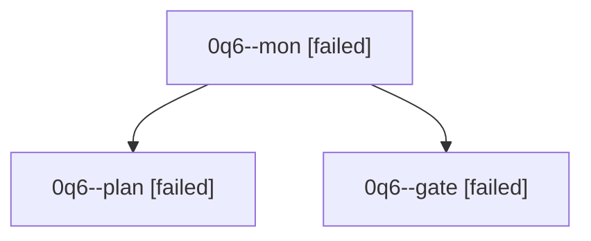

# Family: 0q6

[Agent Hoods](../README.md) / [bbugyi200](../users/bbugyi200/README.md) / [athena](../users/bbugyi200/machines/athena/README.md) / [0q6](../users/bbugyi200/machines/athena/hoods/0q6/README.md) / 0q6

Owner: `bbugyi200.athena` · Hood: `0q6` · Members: 3

## Lineage

The diagram is an optional enhancement; the ordered table below contains the same lineage in accessible text.

| Role | Agent | State | Model / provider | Timing | Commits | Prompt | Chat |
|---|---|---|---|---|---:|---|---|
| mon | 0q6--mon | failed | opus / claude | 2026-09-23T15:58:10.303411+00:00 → 2026-09-23T16:00:23.032137+00:00 | 0 | — | [Chat](../agents/bbugyi200.athena.0q6--mon/chat.md) |
| plan | 0q6--plan | failed | opus / claude | 2026-09-23T15:42:23.819737+00:00 → 2026-09-23T15:58:23.005292+00:00 | 0 | [Prompt](../agents/bbugyi200.athena.0q6--plan/prompt.md) | [Chat](../agents/bbugyi200.athena.0q6--plan/chat.md) |
| gate | 0q6--gate | failed | opus / claude | 2026-09-23T15:56:40.414012+00:00 → 2026-09-23T15:58:11.624806+00:00 | 0 | — | [Chat](../agents/bbugyi200.athena.0q6--gate/chat.md) |
