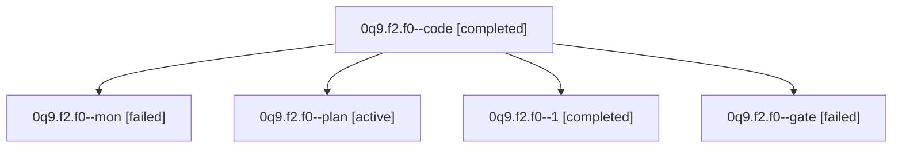

# Family: 0q9.f2.f0

[Agent Hoods](../README.md) / [bbugyi200](../users/bbugyi200/README.md) / [athena](../users/bbugyi200/machines/athena/README.md) / [0q9](../users/bbugyi200/machines/athena/hoods/0q9/README.md) / 0q9.f2.f0

Owner: `bbugyi200.athena` · Hood: `0q9` · Members: 5

## Lineage

The diagram is an optional enhancement; the ordered table below contains the same lineage in accessible text.

| Role | Agent | State | Model / provider | Timing | Commits | Prompt | Chat |
|---|---|---|---|---|---:|---|---|
| code | 0q9.f2.f0--code | completed | muse-spark-1.3-contributor / muse | 2026-09-23T22:22:58.431908+00:00 → 2026-09-23T22:40:10.051551+00:00 | 0 | — | [Chat](../agents/bbugyi200.athena.0q9.f2.f0--code/chat.md) |
| mon | 0q9.f2.f0--mon | failed | muse-spark-1.3-contributor / muse | 2026-09-23T22:39:40.993344+00:00 → 2026-09-23T22:58:31.306098+00:00 | 0 | — | [Chat](../agents/bbugyi200.athena.0q9.f2.f0--mon/chat.md) |
| plan | 0q9.f2.f0--plan | active | opus / claude | 2026-09-23T22:16:16.359225+00:00 | 0 | [Prompt](../agents/bbugyi200.athena.0q9.f2.f0--plan/prompt.md) | [Chat](../agents/bbugyi200.athena.0q9.f2.f0--plan/chat.md) |
| 1 | 0q9.f2.f0--1 | completed | muse-spark-1.3-contributor / muse | 2026-09-23T22:58:31.131458+00:00 → 2026-09-23T23:10:39.657369+00:00 | [1](../agents/bbugyi200.athena.0q9.f2.f0--1/README.md#commits) | [Prompt](../agents/bbugyi200.athena.0q9.f2.f0--1/prompt.md) | [Chat](../agents/bbugyi200.athena.0q9.f2.f0--1/chat.md) |
| gate | 0q9.f2.f0--gate | failed | opus / claude | 2026-09-23T22:21:58.992005+00:00 → 2026-09-23T22:22:33.275532+00:00 | 0 | — | [Chat](../agents/bbugyi200.athena.0q9.f2.f0--gate/chat.md) |

## Commits

| Role | Repo | Commit | Subject | Committed |
|---|---|---|---|---|
| 1 | sase | [`d9f3cbd`](https://github.com/sase-org/sase/commit/d9f3cbd4cc2bf79101ad0f198e29af8f1f88410c) | feat(tui): stash-chip contrast fix with dim-label-only top bar and refreshed goldens | 2026-09-23 19:02:47 EDT |

## Neighbors

| Agent | Relation | State |
|---|---|---|
| [0q9.f2](bbugyi200.athena.0q9.f2.md) (family · 5) | ancestor | active 1, completed 2, failed 2 |
| [0q9](bbugyi200.athena.0q9.md) (family · 3) | ancestor | active 1, completed 1, failed 1 |
| [0q9.f0](../agents/bbugyi200.athena.0q9.f0/README.md) | 0q9 hood | active |
| [0q9.f1](../agents/bbugyi200.athena.0q9.f1/README.md) | 0q9 hood | active |
