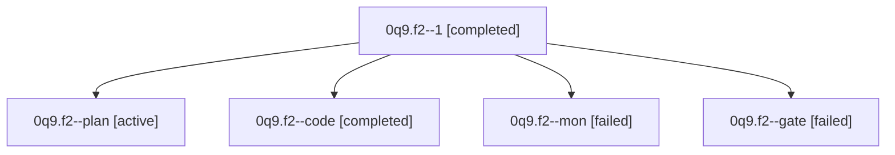

# Family: 0q9.f2

[Agent Hoods](../README.md) / [bbugyi200](../users/bbugyi200/README.md) / [athena](../users/bbugyi200/machines/athena/README.md) / [0q9](../users/bbugyi200/machines/athena/hoods/0q9/README.md) / 0q9.f2

Owner: `bbugyi200.athena` · Hood: `0q9` · Members: 5

## Lineage

The diagram is an optional enhancement; the ordered table below contains the same lineage in accessible text.

| Role | Agent | State | Model / provider | Timing | Commits | Prompt | Chat |
|---|---|---|---|---|---:|---|---|
| 1 | 0q9.f2--1 | completed | muse-spark-1.3-contributor / muse | 2026-09-23T20:54:55.598660+00:00 → 2026-09-23T21:45:30.165351+00:00 | [1](../agents/bbugyi200.athena.0q9.f2--1/README.md#commits) | [Prompt](../agents/bbugyi200.athena.0q9.f2--1/prompt.md) | [Chat](../agents/bbugyi200.athena.0q9.f2--1/chat.md) |
| plan | 0q9.f2--plan | active | opus / claude | 2026-09-23T20:02:20.283826+00:00 | 0 | [Prompt](../agents/bbugyi200.athena.0q9.f2--plan/prompt.md) | [Chat](../agents/bbugyi200.athena.0q9.f2--plan/chat.md) |
| code | 0q9.f2--code | completed | muse-spark-1.3-contributor / muse | 2026-09-23T20:13:34.461720+00:00 → 2026-09-23T20:36:21.824627+00:00 | 0 | — | [Chat](../agents/bbugyi200.athena.0q9.f2--code/chat.md) |
| mon | 0q9.f2--mon | failed | muse-spark-1.3-contributor / muse | 2026-09-23T20:35:22.656459+00:00 → 2026-09-23T20:54:56.100949+00:00 | 0 | — | [Chat](../agents/bbugyi200.athena.0q9.f2--mon/chat.md) |
| gate | 0q9.f2--gate | failed | opus / claude | 2026-09-23T20:12:51.019809+00:00 → 2026-09-23T20:13:14.519899+00:00 | 0 | — | [Chat](../agents/bbugyi200.athena.0q9.f2--gate/chat.md) |

## Commits

| Role | Repo | Commit | Subject | Committed |
|---|---|---|---|---|
| 1 | sase | [`c44f696`](https://github.com/sase-org/sase/commit/c44f696184153010e0b4abab3460d40b10c6e06f) | feat(ace): add provider-priority icon chip to top-bar indicator cluster | 2026-09-23 17:36:28 EDT |

## Neighbors

| Agent | Relation | State |
|---|---|---|
| [0q9](bbugyi200.athena.0q9.md) (family · 3) | ancestor | active 1, completed 1, failed 1 |
| [0q9.f2.f0](bbugyi200.athena.0q9.f2.f0.md) (family · 5) | descendant | active 1, completed 2, failed 2 |
| [0q9.f0](../agents/bbugyi200.athena.0q9.f0/README.md) | 0q9 hood | active |
| [0q9.f1](../agents/bbugyi200.athena.0q9.f1/README.md) | 0q9 hood | active |
