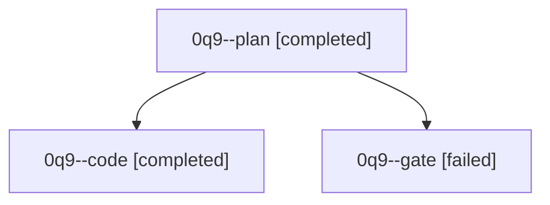

# Family: 0q9

[Agent Hoods](../README.md) / [bbugyi200](../users/bbugyi200/README.md) / [athena](../users/bbugyi200/machines/athena/README.md) / [0q9](../users/bbugyi200/machines/athena/hoods/0q9/README.md) / 0q9

Owner: `bbugyi200.athena` · Hood: `0q9` · Members: 3

## Lineage

The diagram is an optional enhancement; the ordered table below contains the same lineage in accessible text.

| Role | Agent | State | Model / provider | Timing | Commits | Prompt | Chat |
|---|---|---|---|---|---:|---|---|
| plan | 0q9--plan | completed | opus / claude | 2026-09-23T19:07:45.092706+00:00 → 2026-09-23T19:16:50.430989+00:00 | 0 | [Prompt](../agents/bbugyi200.athena.0q9--plan/prompt.md) | [Chat](../agents/bbugyi200.athena.0q9--plan/chat.md) |
| code | 0q9--code | completed | muse-spark-1.3-contributor / muse | 2026-09-23T19:18:13.502071+00:00 → 2026-09-23T19:55:16.309287+00:00 | [1](../agents/bbugyi200.athena.0q9--code/README.md#commits) | [Prompt](../agents/bbugyi200.athena.0q9--code/prompt.md) | [Chat](../agents/bbugyi200.athena.0q9--code/chat.md) |
| gate | 0q9--gate | failed | opus / claude | 2026-09-23T19:17:03.244987+00:00 → 2026-09-23T19:17:53.479560+00:00 | 0 | — | [Chat](../agents/bbugyi200.athena.0q9--gate/chat.md) |

## Commits

| Role | Repo | Commit | Subject | Committed |
|---|---|---|---|---|
| code | sase | [`f4d70c4`](https://github.com/sase-org/sase/commit/f4d70c452b5cd668cb637b73422f7a0dfa4999d8) | feat(ace): labeled dot-separated top-bar indicator cluster | 2026-09-23 15:51:50 EDT |

## Neighbors

| Agent | Relation | State |
|---|---|---|
| [0q9.f0](../agents/bbugyi200.athena.0q9.f0/README.md) | descendant | active |
| [0q9.f1](../agents/bbugyi200.athena.0q9.f1/README.md) | descendant | active |
| [0q9.f2](bbugyi200.athena.0q9.f2.md) (family · 5) | descendant | completed 3, failed 2 |
| [0q9.f2.f0](bbugyi200.athena.0q9.f2.f0.md) (family · 3) | descendant | active 2, failed 1 |
