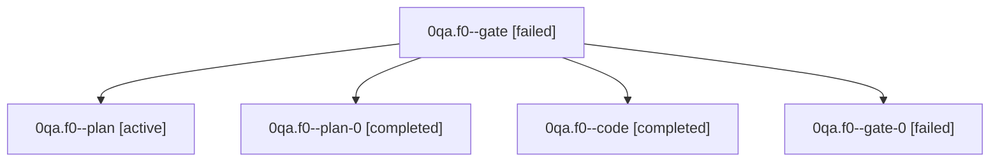

# Family: 0qa.f0

[Agent Hoods](../README.md) / [bbugyi200](../users/bbugyi200/README.md) / [athena](../users/bbugyi200/machines/athena/README.md) / [0qa](../users/bbugyi200/machines/athena/hoods/0qa/README.md) / 0qa.f0

Owner: `bbugyi200.athena` · Hood: `0qa` · Members: 5

## Lineage

The diagram is an optional enhancement; the ordered table below contains the same lineage in accessible text.

| Role | Agent | State | Model / provider | Timing | Commits | Prompt | Chat |
|---|---|---|---|---|---:|---|---|
| gate | 0qa.f0--gate | failed | opus / claude | 2026-09-23T19:43:52.193071+00:00 → 2026-09-23T19:44:43.650055+00:00 | 0 | — | [Chat](../agents/bbugyi200.athena.0qa.f0--gate/chat.md) |
| plan | 0qa.f0--plan | active | opus / claude | 2026-09-23T19:20:16.019519+00:00 | 0 | [Prompt](../agents/bbugyi200.athena.0qa.f0--plan/prompt.md) | [Chat](../agents/bbugyi200.athena.0qa.f0--plan/chat.md) |
| plan-0 | 0qa.f0--plan-0 | completed | opus / claude | 2026-09-23T19:45:21.717308+00:00 → 2026-09-23T19:49:48.251845+00:00 | 0 | [Prompt](../agents/bbugyi200.athena.0qa.f0--plan-0/prompt.md) | [Chat](../agents/bbugyi200.athena.0qa.f0--plan-0/chat.md) |
| code | 0qa.f0--code | completed | muse-spark-1.3-contributor / muse | 2026-09-23T19:55:05.906331+00:00 → 2026-09-23T20:25:20.912524+00:00 | [1](../agents/bbugyi200.athena.0qa.f0--code/README.md#commits) | [Prompt](../agents/bbugyi200.athena.0qa.f0--code/prompt.md) | [Chat](../agents/bbugyi200.athena.0qa.f0--code/chat.md) |
| gate-0 | 0qa.f0--gate-0 | failed | opus / claude | 2026-09-23T19:53:40.104793+00:00 → 2026-09-23T19:54:42.423090+00:00 | 0 | — | [Chat](../agents/bbugyi200.athena.0qa.f0--gate-0/chat.md) |

## Commits

| Role | Repo | Commit | Subject | Committed |
|---|---|---|---|---|
| code | sase | [`9839653`](https://github.com/sase-org/sase/commit/9839653612ccfba08a171d242f72a93fdd35adb3) | feat(memory): add Agent Relation Jump Target glossary strand | 2026-09-23 16:22:31 EDT |

## Neighbors

| Agent | Relation | State |
|---|---|---|
| [0qa](bbugyi200.athena.0qa.md) (family · 3) | ancestor | active 1, completed 1, failed 1 |
