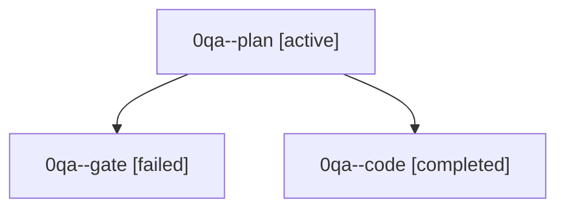

# Family: 0qa

[Agent Hoods](../README.md) / [bbugyi200](../users/bbugyi200/README.md) / [athena](../users/bbugyi200/machines/athena/README.md) / [0qa](../users/bbugyi200/machines/athena/hoods/0qa/README.md) / 0qa

Owner: `bbugyi200.athena` · Hood: `0qa` · Members: 3

## Lineage

The diagram is an optional enhancement; the ordered table below contains the same lineage in accessible text.

| Role | Agent | State | Model / provider | Timing | Commits | Prompt | Chat |
|---|---|---|---|---|---:|---|---|
| plan | 0qa--plan | active | opus / claude | 2026-09-23T19:10:18.628900+00:00 | 0 | [Prompt](../agents/bbugyi200.athena.0qa--plan/prompt.md) | [Chat](../agents/bbugyi200.athena.0qa--plan/chat.md) |
| gate | 0qa--gate | failed | opus / claude | 2026-09-23T19:20:54.921239+00:00 → 2026-09-23T19:22:30.213048+00:00 | 0 | — | [Chat](../agents/bbugyi200.athena.0qa--gate/chat.md) |
| code | 0qa--code | completed | muse-spark-1.3-contributor / muse | 2026-09-23T19:22:59.129475+00:00 → 2026-09-23T20:38:55.999844+00:00 | [1](../agents/bbugyi200.athena.0qa--code/README.md#commits) | [Prompt](../agents/bbugyi200.athena.0qa--code/prompt.md) | [Chat](../agents/bbugyi200.athena.0qa--code/chat.md) |

## Commits

| Role | Repo | Commit | Subject | Committed |
|---|---|---|---|---|
| code | sase | [`78f1d71`](https://github.com/sase-org/sase/commit/78f1d71e79450382b6b71b7fe9863600c1b02760) | feat(ace): move numbered roster sections into Agents jump panel | 2026-09-23 16:33:57 EDT |

## Neighbors

| Agent | Relation | State |
|---|---|---|
| [0qa.f0](bbugyi200.athena.0qa.f0.md) (family · 5) | descendant | active 1, completed 2, failed 2 |
