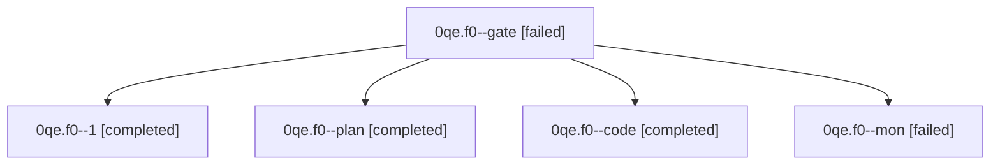

# Family: 0qe.f0

[Agent Hoods](../README.md) / [bbugyi200](../users/bbugyi200/README.md) / [athena](../users/bbugyi200/machines/athena/README.md) / [0qe](../users/bbugyi200/machines/athena/hoods/0qe/README.md) / 0qe.f0

Owner: `bbugyi200.athena` · Hood: `0qe` · Members: 5

## Lineage

The diagram is an optional enhancement; the ordered table below contains the same lineage in accessible text.

| Role | Agent | State | Model / provider | Timing | Commits | Prompt | Chat |
|---|---|---|---|---|---:|---|---|
| gate | 0qe.f0--gate | failed | opus / claude | 2026-09-24T00:56:42.252594+00:00 → 2026-09-24T00:57:10.662578+00:00 | 0 | — | [Chat](../agents/bbugyi200.athena.0qe.f0--gate/chat.md) |
| 1 | 0qe.f0--1 | completed | muse-spark-1.3-contributor / muse | 2026-09-24T01:12:04.565701+00:00 → 2026-09-24T01:25:27.287174+00:00 | [1](../agents/bbugyi200.athena.0qe.f0--1/README.md#commits) | [Prompt](../agents/bbugyi200.athena.0qe.f0--1/prompt.md) | [Chat](../agents/bbugyi200.athena.0qe.f0--1/chat.md) |
| plan | 0qe.f0--plan | completed | opus / claude | 2026-09-24T00:50:17.159754+00:00 → 2026-09-24T01:07:35.139666+00:00 | 0 | [Prompt](../agents/bbugyi200.athena.0qe.f0--plan/prompt.md) | [Chat](../agents/bbugyi200.athena.0qe.f0--plan/chat.md) |
| code | 0qe.f0--code | completed | muse-spark-1.3-contributor / muse | 2026-09-24T00:57:32.282094+00:00 → 2026-09-24T01:07:35.139666+00:00 | 0 | — | [Chat](../agents/bbugyi200.athena.0qe.f0--code/chat.md) |
| mon | 0qe.f0--mon | failed | muse-spark-1.3-contributor / muse | 2026-09-24T01:07:12.151702+00:00 → 2026-09-24T01:11:56.921504+00:00 | 0 | — | [Chat](../agents/bbugyi200.athena.0qe.f0--mon/chat.md) |

## Commits

| Role | Repo | Commit | Subject | Committed |
|---|---|---|---|---|
| 1 | sase | [`e392000`](https://github.com/sase-org/sase/commit/e392000cd11cf33bc02c99559a9e014d33fcc98e) | fix(finalizers): read live bead status when validating close at submit | 2026-09-23 21:21:47 EDT |

## Neighbors

| Agent | Relation | State |
|---|---|---|
| [0qe](../agents/bbugyi200.athena.0qe/README.md) | ancestor | completed |
