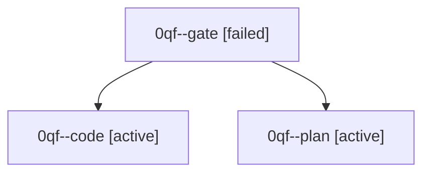

# Family: 0qf

[Agent Hoods](../README.md) / [bbugyi200](../users/bbugyi200/README.md) / [athena](../users/bbugyi200/machines/athena/README.md) / [0qf](../users/bbugyi200/machines/athena/hoods/0qf/README.md) / 0qf

Owner: `bbugyi200.athena` · Hood: `0qf` · Members: 3

## Lineage

The diagram is an optional enhancement; the ordered table below contains the same lineage in accessible text.

| Role | Agent | State | Model / provider | Timing | Commits | Prompt | Chat |
|---|---|---|---|---|---:|---|---|
| gate | 0qf--gate | failed | opus / claude | 2026-09-24T00:45:35.705626+00:00 → 2026-09-24T00:46:01.375188+00:00 | 0 | — | [Chat](../agents/bbugyi200.athena.0qf--gate/chat.md) |
| code | 0qf--code | active | muse-spark-1.3-contributor / muse | 2026-09-24T00:46:21.105195+00:00 | 0 | — | [Chat](../agents/bbugyi200.athena.0qf--code/chat.md) |
| plan | 0qf--plan | active | opus / claude | 2026-09-24T00:41:59.457765+00:00 | 0 | [Prompt](../agents/bbugyi200.athena.0qf--plan/prompt.md) | [Chat](../agents/bbugyi200.athena.0qf--plan/chat.md) |
