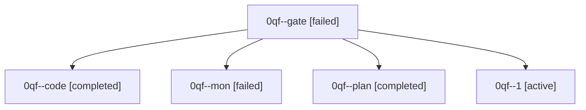

# Family: 0qf

[Agent Hoods](../README.md) / [bbugyi200](../users/bbugyi200/README.md) / [athena](../users/bbugyi200/machines/athena/README.md) / [0qf](../users/bbugyi200/machines/athena/hoods/0qf/README.md) / 0qf

Owner: `bbugyi200.athena` · Hood: `0qf` · Members: 5

## Lineage

The diagram is an optional enhancement; the ordered table below contains the same lineage in accessible text.

| Role | Agent | State | Model / provider | Timing | Commits | Prompt | Chat |
|---|---|---|---|---|---:|---|---|
| gate | 0qf--gate | failed | opus / claude | 2026-09-24T00:45:35.705626+00:00 → 2026-09-24T00:46:01.375188+00:00 | 0 | — | [Chat](../agents/bbugyi200.athena.0qf--gate/chat.md) |
| code | 0qf--code | completed | muse-spark-1.3-contributor / muse | 2026-09-24T00:46:21.105195+00:00 → 2026-09-24T00:54:20.662691+00:00 | 0 | — | [Chat](../agents/bbugyi200.athena.0qf--code/chat.md) |
| mon | 0qf--mon | failed | muse-spark-1.3-contributor / muse | 2026-09-24T00:53:45.302896+00:00 → 2026-09-24T01:02:50.601867+00:00 | 0 | — | [Chat](../agents/bbugyi200.athena.0qf--mon/chat.md) |
| plan | 0qf--plan | completed | opus / claude | 2026-09-24T00:41:59.457765+00:00 → 2026-09-24T00:54:20.662691+00:00 | 0 | [Prompt](../agents/bbugyi200.athena.0qf--plan/prompt.md) | [Chat](../agents/bbugyi200.athena.0qf--plan/chat.md) |
| 1 | 0qf--1 | active | muse-spark-1.3-contributor / muse | 2026-09-24T01:03:26.516702+00:00 | [1](../agents/bbugyi200.athena.0qf--1/README.md#commits) | [Prompt](../agents/bbugyi200.athena.0qf--1/prompt.md) | — |

## Commits

| Role | Repo | Commit | Subject | Committed |
|---|---|---|---|---|
| 1 | sase | [`bc1a9bf`](https://github.com/sase-org/sase/commit/bc1a9bf1da0827e9b2aa4a18acfa8312c26e611e) | feat(ace-tui): merge monitor chip into procs indicator and add updates arrow | 2026-09-23 21:17:14 EDT |
