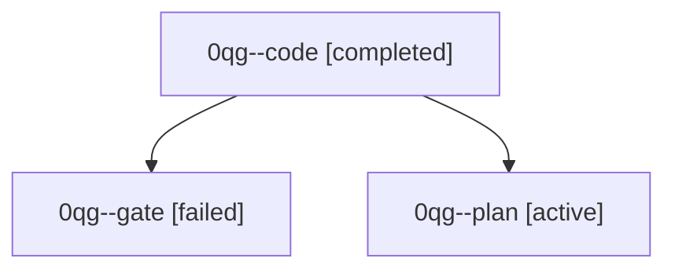

# Family: 0qg

[Agent Hoods](../README.md) / [bbugyi200](../users/bbugyi200/README.md) / [athena](../users/bbugyi200/machines/athena/README.md) / [0qg](../users/bbugyi200/machines/athena/hoods/0qg/README.md) / 0qg

Owner: `bbugyi200.athena` · Hood: `0qg` · Members: 3

## Lineage

The diagram is an optional enhancement; the ordered table below contains the same lineage in accessible text.

| Role | Agent | State | Model / provider | Timing | Commits | Prompt | Chat |
|---|---|---|---|---|---:|---|---|
| code | 0qg--code | completed | muse-spark-1.3-contributor / muse | 2026-09-24T01:13:38.964089+00:00 → 2026-09-24T01:30:00.333083+00:00 | [1](../agents/bbugyi200.athena.0qg--code/README.md#commits) | [Prompt](../agents/bbugyi200.athena.0qg--code/prompt.md) | [Chat](../agents/bbugyi200.athena.0qg--code/chat.md) |
| gate | 0qg--gate | failed | opus / claude | 2026-09-24T01:11:47.637079+00:00 → 2026-09-24T01:13:00.611933+00:00 | 0 | — | [Chat](../agents/bbugyi200.athena.0qg--gate/chat.md) |
| plan | 0qg--plan | active | opus / claude | 2026-09-24T01:07:02.341514+00:00 | 0 | [Prompt](../agents/bbugyi200.athena.0qg--plan/prompt.md) | [Chat](../agents/bbugyi200.athena.0qg--plan/chat.md) |

## Commits

| Role | Repo | Commit | Subject | Committed |
|---|---|---|---|---|
| code | sase | [`8eb0c63`](https://github.com/sase-org/sase/commit/8eb0c6308e6af2e425a56c42c221818d1a2b3671) | feat(agents): never fold jump panel neighbors out | 2026-09-23 21:26:49 EDT |
