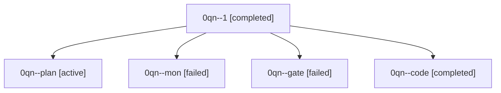

# Family: 0qn

[Agent Hoods](../README.md) / [bbugyi200](../users/bbugyi200/README.md) / [athena](../users/bbugyi200/machines/athena/README.md) / [0qn](../users/bbugyi200/machines/athena/hoods/0qn/README.md) / 0qn

Owner: `bbugyi200.athena` · Hood: `0qn` · Members: 5

## Lineage

The diagram is an optional enhancement; the ordered table below contains the same lineage in accessible text.

| Role | Agent | State | Model / provider | Timing | Commits | Prompt | Chat |
|---|---|---|---|---|---:|---|---|
| 1 | 0qn--1 | completed | muse-spark-1.3-contributor / muse | 2026-09-24T14:27:25.462487+00:00 → 2026-09-24T14:51:03.653904+00:00 | [1](../agents/bbugyi200.athena.0qn--1/README.md#commits) | [Prompt](../agents/bbugyi200.athena.0qn--1/prompt.md) | [Chat](../agents/bbugyi200.athena.0qn--1/chat.md) |
| plan | 0qn--plan | active | opus / claude | 2026-09-24T13:53:54.093102+00:00 | 0 | [Prompt](../agents/bbugyi200.athena.0qn--plan/prompt.md) | [Chat](../agents/bbugyi200.athena.0qn--plan/chat.md) |
| mon | 0qn--mon | failed | muse-spark-1.3-contributor / muse | 2026-09-24T14:16:35.947632+00:00 → 2026-09-24T14:25:51.844152+00:00 | 0 | — | [Chat](../agents/bbugyi200.athena.0qn--mon/chat.md) |
| gate | 0qn--gate | failed | opus / claude | 2026-09-24T14:04:50.302546+00:00 → 2026-09-24T14:05:43.553159+00:00 | 0 | — | [Chat](../agents/bbugyi200.athena.0qn--gate/chat.md) |
| code | 0qn--code | completed | muse-spark-1.3-contributor / muse | 2026-09-24T14:06:18.758297+00:00 → 2026-09-24T14:19:29.365429+00:00 | 0 | [Prompt](../agents/bbugyi200.athena.0qn--code/prompt.md) | [Chat](../agents/bbugyi200.athena.0qn--code/chat.md) |

## Commits

| Role | Repo | Commit | Subject | Committed |
|---|---|---|---|---|
| 1 | sase | [`0f65d54`](https://github.com/sase-org/sase/commit/0f65d549f9672a27558a3b41900bbaa9c8bb6f98) | feat(ace): show green update gear while SASE is updating | 2026-09-24 10:47:24 EDT |
