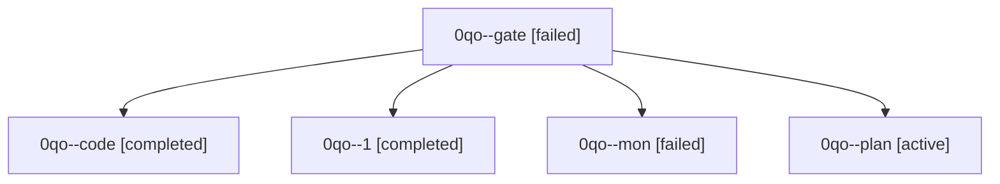

# Family: 0qo

[Agent Hoods](../README.md) / [bbugyi200](../users/bbugyi200/README.md) / [athena](../users/bbugyi200/machines/athena/README.md) / [0qo](../users/bbugyi200/machines/athena/hoods/0qo/README.md) / 0qo

Owner: `bbugyi200.athena` · Hood: `0qo` · Members: 5

## Lineage

The diagram is an optional enhancement; the ordered table below contains the same lineage in accessible text.

| Role | Agent | State | Model / provider | Timing | Commits | Prompt | Chat |
|---|---|---|---|---|---:|---|---|
| gate | 0qo--gate | failed | opus / claude | 2026-09-24T14:29:15.743784+00:00 → 2026-09-24T14:29:46.025394+00:00 | 0 | — | [Chat](../agents/bbugyi200.athena.0qo--gate/chat.md) |
| code | 0qo--code | completed | muse-spark-1.3-contributor / muse | 2026-09-24T14:31:17.135139+00:00 → 2026-09-24T14:40:39.323357+00:00 | 0 | — | [Chat](../agents/bbugyi200.athena.0qo--code/chat.md) |
| 1 | 0qo--1 | completed | muse-spark-1.3-contributor / muse | 2026-09-24T14:46:00.314532+00:00 → 2026-09-24T14:56:43.031059+00:00 | [1](../agents/bbugyi200.athena.0qo--1/README.md#commits) | [Prompt](../agents/bbugyi200.athena.0qo--1/prompt.md) | [Chat](../agents/bbugyi200.athena.0qo--1/chat.md) |
| mon | 0qo--mon | failed | muse-spark-1.3-contributor / muse | 2026-09-24T14:40:06.590400+00:00 → 2026-09-24T14:45:51.924685+00:00 | 0 | — | [Chat](../agents/bbugyi200.athena.0qo--mon/chat.md) |
| plan | 0qo--plan | active | opus / claude | 2026-09-24T14:21:29.998312+00:00 | 0 | [Prompt](../agents/bbugyi200.athena.0qo--plan/prompt.md) | [Chat](../agents/bbugyi200.athena.0qo--plan/chat.md) |

## Commits

| Role | Repo | Commit | Subject | Committed |
|---|---|---|---|---|
| 1 | sase | [`77e0cfb`](https://github.com/sase-org/sase/commit/77e0cfb6c043a1da3efc4c164d9ea328cbe50b77) | feat(ace): route bead hints to pager live detail with copy support | 2026-09-24 10:54:02 EDT |
