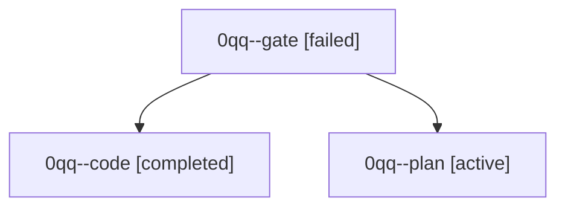

# Family: 0qq

[Agent Hoods](../README.md) / [bbugyi200](../users/bbugyi200/README.md) / [athena](../users/bbugyi200/machines/athena/README.md) / [0qq](../users/bbugyi200/machines/athena/hoods/0qq/README.md) / 0qq

Owner: `bbugyi200.athena` · Hood: `0qq` · Members: 3

## Lineage

The diagram is an optional enhancement; the ordered table below contains the same lineage in accessible text.

| Role | Agent | State | Model / provider | Timing | Commits | Prompt | Chat |
|---|---|---|---|---|---:|---|---|
| gate | 0qq--gate | failed | opus / claude | 2026-09-24T14:45:07.918695+00:00 → 2026-09-24T14:46:01.706715+00:00 | 0 | — | [Chat](../agents/bbugyi200.athena.0qq--gate/chat.md) |
| code | 0qq--code | completed | muse-spark-1.3-contributor / muse | 2026-09-24T14:46:23.511701+00:00 → 2026-09-24T15:28:35.674702+00:00 | [1](../agents/bbugyi200.athena.0qq--code/README.md#commits) | [Prompt](../agents/bbugyi200.athena.0qq--code/prompt.md) | [Chat](../agents/bbugyi200.athena.0qq--code/chat.md) |
| plan | 0qq--plan | active | opus / claude | 2026-09-24T14:34:54.645489+00:00 | 0 | [Prompt](../agents/bbugyi200.athena.0qq--plan/prompt.md) | [Chat](../agents/bbugyi200.athena.0qq--plan/chat.md) |

## Commits

| Role | Repo | Commit | Subject | Committed |
|---|---|---|---|---|
| code | sase | [`e80b948`](https://github.com/sase-org/sase/commit/e80b948c3e92c52a327e96a019895bdee0f92860) | feat(services): sticky collapsible description header for service proc rows | 2026-09-24 11:25:24 EDT |
