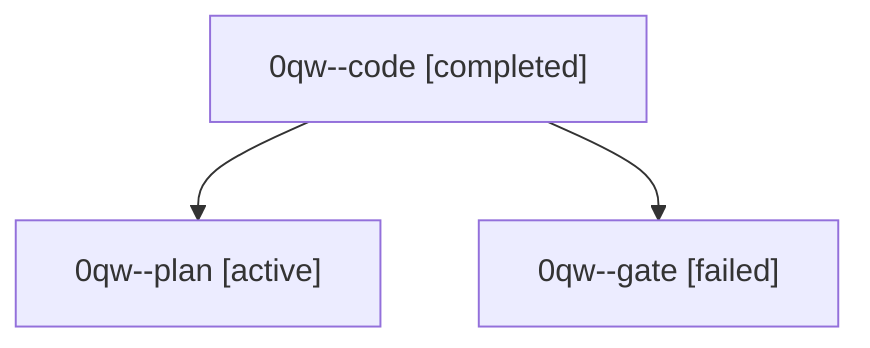

# Family: 0qw

[Agent Hoods](../README.md) / [bbugyi200](../users/bbugyi200/README.md) / [athena](../users/bbugyi200/machines/athena/README.md) / [0qw](../users/bbugyi200/machines/athena/hoods/0qw/README.md) / 0qw

Owner: `bbugyi200.athena` · Hood: `0qw` · Members: 3

## Lineage

The diagram is an optional enhancement; the ordered table below contains the same lineage in accessible text.

| Role | Agent | State | Model / provider | Timing | Commits | Prompt | Chat |
|---|---|---|---|---|---:|---|---|
| code | 0qw--code | completed | muse-spark-1.3-contributor / muse | 2026-09-24T16:01:34.722545+00:00 → 2026-09-24T16:45:03.174435+00:00 | [1](../agents/bbugyi200.athena.0qw--code/README.md#commits) | [Prompt](../agents/bbugyi200.athena.0qw--code/prompt.md) | [Chat](../agents/bbugyi200.athena.0qw--code/chat.md) |
| plan | 0qw--plan | active | opus / claude | 2026-09-24T15:40:39.472480+00:00 | 0 | [Prompt](../agents/bbugyi200.athena.0qw--plan/prompt.md) | [Chat](../agents/bbugyi200.athena.0qw--plan/chat.md) |
| gate | 0qw--gate | failed | opus / claude | 2026-09-24T15:56:01.391976+00:00 → 2026-09-24T15:57:35.194119+00:00 | 0 | — | [Chat](../agents/bbugyi200.athena.0qw--gate/chat.md) |

## Commits

| Role | Repo | Commit | Subject | Committed |
|---|---|---|---|---|
| code | sase | [`b69c86a`](https://github.com/sase-org/sase/commit/b69c86a0402495e2e81ad91b54f7cad46a3a10f9) | feat(ace): open Updates tab from cache, refresh only on r | 2026-09-24 12:42:05 EDT |
