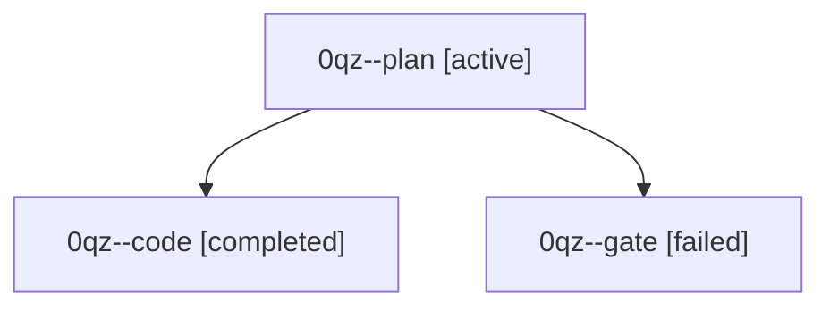

# Family: 0qz

[Agent Hoods](../README.md) / [bbugyi200](../users/bbugyi200/README.md) / [athena](../users/bbugyi200/machines/athena/README.md) / [0qz](../users/bbugyi200/machines/athena/hoods/0qz/README.md) / 0qz

Owner: `bbugyi200.athena` · Hood: `0qz` · Members: 3

## Lineage

The diagram is an optional enhancement; the ordered table below contains the same lineage in accessible text.

| Role | Agent | State | Model / provider | Timing | Commits | Prompt | Chat |
|---|---|---|---|---|---:|---|---|
| plan | 0qz--plan | active | opus / claude | 2026-09-24T16:07:55.386907+00:00 | 0 | [Prompt](../agents/bbugyi200.athena.0qz--plan/prompt.md) | [Chat](../agents/bbugyi200.athena.0qz--plan/chat.md) |
| code | 0qz--code | completed | muse-spark-1.3-contributor / muse | 2026-09-24T16:43:12.499700+00:00 → 2026-09-24T18:00:23.507733+00:00 | [1](../agents/bbugyi200.athena.0qz--code/README.md#commits) | [Prompt](../agents/bbugyi200.athena.0qz--code/prompt.md) | [Chat](../agents/bbugyi200.athena.0qz--code/chat.md) |
| gate | 0qz--gate | failed | opus / claude | 2026-09-24T16:28:50.492112+00:00 → 2026-09-24T16:33:16.834601+00:00 | 0 | — | [Chat](../agents/bbugyi200.athena.0qz--gate/chat.md) |

## Commits

| Role | Repo | Commit | Subject | Committed |
|---|---|---|---|---|
| code | sase | [`0648306`](https://github.com/sase-org/sase/commit/0648306324275f38bb1da9f15ef18835d77b4a31) | fix(symvision): return just symvision to green on master | 2026-09-24 13:58:03 EDT |
