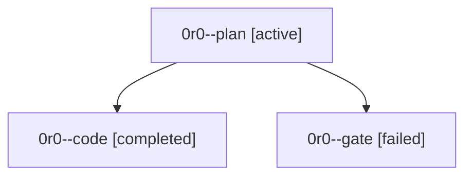

# Family: 0r0

[Agent Hoods](../README.md) / [bbugyi200](../users/bbugyi200/README.md) / [athena](../users/bbugyi200/machines/athena/README.md) / [0r0](../users/bbugyi200/machines/athena/hoods/0r0/README.md) / 0r0

Owner: `bbugyi200.athena` · Hood: `0r0` · Members: 3

## Lineage

The diagram is an optional enhancement; the ordered table below contains the same lineage in accessible text.

| Role | Agent | State | Model / provider | Timing | Commits | Prompt | Chat |
|---|---|---|---|---|---:|---|---|
| plan | 0r0--plan | active | opus / claude | 2026-09-24T16:22:29.248886+00:00 | 0 | [Prompt](../agents/bbugyi200.athena.0r0--plan/prompt.md) | [Chat](../agents/bbugyi200.athena.0r0--plan/chat.md) |
| code | 0r0--code | completed | sonnet / claude | 2026-09-24T16:53:05.353958+00:00 → 2026-09-24T17:41:57.511843+00:00 | [1](../agents/bbugyi200.athena.0r0--code/README.md#commits) | [Prompt](../agents/bbugyi200.athena.0r0--code/prompt.md) | [Chat](../agents/bbugyi200.athena.0r0--code/chat.md) |
| gate | 0r0--gate | failed | opus / claude | 2026-09-24T16:44:50.108179+00:00 → 2026-09-24T16:47:57.827334+00:00 | 0 | — | [Chat](../agents/bbugyi200.athena.0r0--gate/chat.md) |

## Commits

| Role | Repo | Commit | Subject | Committed |
|---|---|---|---|---|
| code | sase | [`fbee04c`](https://github.com/sase-org/sase/commit/fbee04cd1d84e5f28657c5d399c54351a179bcd7) | fix(agent-names): scope forced-reuse wipes of session members to their own subtree | 2026-09-24 13:38:57 EDT |
