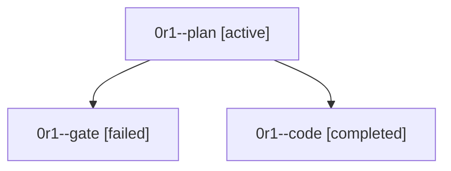

# Family: 0r1

[Agent Hoods](../README.md) / [bbugyi200](../users/bbugyi200/README.md) / [athena](../users/bbugyi200/machines/athena/README.md) / [0r1](../users/bbugyi200/machines/athena/hoods/0r1/README.md) / 0r1

Owner: `bbugyi200.athena` · Hood: `0r1` · Members: 3

## Lineage

The diagram is an optional enhancement; the ordered table below contains the same lineage in accessible text.

| Role | Agent | State | Model / provider | Timing | Commits | Prompt | Chat |
|---|---|---|---|---|---:|---|---|
| plan | 0r1--plan | active | opus / claude | 2026-09-24T16:55:14.023412+00:00 | 0 | [Prompt](../agents/bbugyi200.athena.0r1--plan/prompt.md) | [Chat](../agents/bbugyi200.athena.0r1--plan/chat.md) |
| gate | 0r1--gate | failed | opus / claude | 2026-09-24T17:10:08.436685+00:00 → 2026-09-24T17:12:56.388286+00:00 | 0 | — | [Chat](../agents/bbugyi200.athena.0r1--gate/chat.md) |
| code | 0r1--code | completed | gpt-5.6-terra / codex | 2026-09-24T17:22:13.697364+00:00 → 2026-09-24T17:40:21.074087+00:00 | [1](../agents/bbugyi200.athena.0r1--code/README.md#commits) | [Prompt](../agents/bbugyi200.athena.0r1--code/prompt.md) | [Chat](../agents/bbugyi200.athena.0r1--code/chat.md) |

## Commits

| Role | Repo | Commit | Subject | Committed |
|---|---|---|---|---|
| code | sase | [`9bd351b`](https://github.com/sase-org/sase/commit/9bd351b677ed6b7375db9807964d08b6396346af) | fix(wait): confirm release membership before family handoff | 2026-09-24 13:36:47 EDT |
