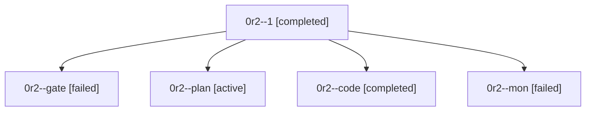

# Family: 0r2

[Agent Hoods](../README.md) / [bbugyi200](../users/bbugyi200/README.md) / [athena](../users/bbugyi200/machines/athena/README.md) / [0r2](../users/bbugyi200/machines/athena/hoods/0r2/README.md) / 0r2

Owner: `bbugyi200.athena` · Hood: `0r2` · Members: 5

## Lineage

The diagram is an optional enhancement; the ordered table below contains the same lineage in accessible text.

| Role | Agent | State | Model / provider | Timing | Commits | Prompt | Chat |
|---|---|---|---|---|---:|---|---|
| 1 | 0r2--1 | completed | muse-spark-1.3-contributor / muse | 2026-09-24T19:34:27.059432+00:00 → 2026-09-24T19:45:53.983812+00:00 | [1](../agents/bbugyi200.athena.0r2--1/README.md#commits) | [Prompt](../agents/bbugyi200.athena.0r2--1/prompt.md) | [Chat](../agents/bbugyi200.athena.0r2--1/chat.md) |
| gate | 0r2--gate | failed | gpt-5.6-sol / codex | 2026-09-24T18:04:48.178733+00:00 → 2026-09-24T18:05:57.457478+00:00 | 0 | — | [Chat](../agents/bbugyi200.athena.0r2--gate/chat.md) |
| plan | 0r2--plan | active | gpt-5.6-sol / codex | 2026-09-24T17:55:47.442111+00:00 | 0 | [Prompt](../agents/bbugyi200.athena.0r2--plan/prompt.md) | [Chat](../agents/bbugyi200.athena.0r2--plan/chat.md) |
| code | 0r2--code | completed | muse-spark-1.3-contributor / muse | 2026-09-24T18:06:30.053089+00:00 → 2026-09-24T18:15:56.936229+00:00 | 0 | [Prompt](../agents/bbugyi200.athena.0r2--code/prompt.md) | [Chat](../agents/bbugyi200.athena.0r2--code/chat.md) |
| mon | 0r2--mon | failed | muse-spark-1.3-contributor / muse | 2026-09-24T18:15:35.711152+00:00 → 2026-09-24T18:42:42.704982+00:00 | 0 | — | [Chat](../agents/bbugyi200.athena.0r2--mon/chat.md) |

## Commits

| Role | Repo | Commit | Subject | Committed |
|---|---|---|---|---|
| 1 | sase | [`682089c`](https://github.com/sase-org/sase/commit/682089c845f29055ef21d1f5b535bee13bbc822e) | feat(models): add GPT-6 Sol selection and make it the Sol default | 2026-09-24 15:42:08 EDT |
