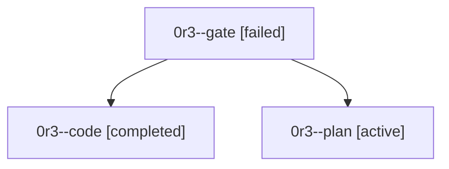

# Family: 0r3

[Agent Hoods](../README.md) / [bbugyi200](../users/bbugyi200/README.md) / [athena](../users/bbugyi200/machines/athena/README.md) / [0r3](../users/bbugyi200/machines/athena/hoods/0r3/README.md) / 0r3

Owner: `bbugyi200.athena` · Hood: `0r3` · Members: 3

## Lineage

The diagram is an optional enhancement; the ordered table below contains the same lineage in accessible text.

| Role | Agent | State | Model / provider | Timing | Commits | Prompt | Chat |
|---|---|---|---|---|---:|---|---|
| gate | 0r3--gate | failed | opus / claude | 2026-09-24T18:25:58.584047+00:00 → 2026-09-24T18:36:15.483464+00:00 | 0 | — | [Chat](../agents/bbugyi200.athena.0r3--gate/chat.md) |
| code | 0r3--code | completed | muse-spark-1.3-contributor / muse | 2026-09-24T18:42:38.281565+00:00 → 2026-09-24T19:02:46.239300+00:00 | [1](../agents/bbugyi200.athena.0r3--code/README.md#commits) | [Prompt](../agents/bbugyi200.athena.0r3--code/prompt.md) | [Chat](../agents/bbugyi200.athena.0r3--code/chat.md) |
| plan | 0r3--plan | active | opus / claude | 2026-09-24T18:00:31.439668+00:00 | 0 | [Prompt](../agents/bbugyi200.athena.0r3--plan/prompt.md) | [Chat](../agents/bbugyi200.athena.0r3--plan/chat.md) |

## Commits

| Role | Repo | Commit | Subject | Committed |
|---|---|---|---|---|
| code | sase | [`126dd63`](https://github.com/sase-org/sase/commit/126dd63c0a0f1fd2707da177cb96505100076983) | feat(agents): same-tick unread marker for completed agents | 2026-09-24 15:01:40 EDT |
