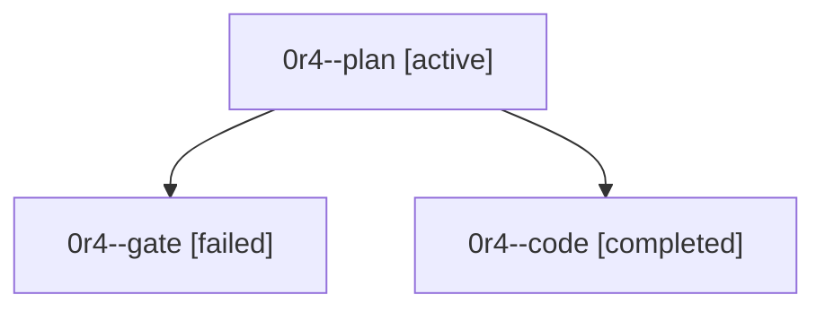

# Family: 0r4

[Agent Hoods](../README.md) / [bbugyi200](../users/bbugyi200/README.md) / [athena](../users/bbugyi200/machines/athena/README.md) / [0r4](../users/bbugyi200/machines/athena/hoods/0r4/README.md) / 0r4

Owner: `bbugyi200.athena` · Hood: `0r4` · Members: 3

## Lineage

The diagram is an optional enhancement; the ordered table below contains the same lineage in accessible text.

| Role | Agent | State | Model / provider | Timing | Commits | Prompt | Chat |
|---|---|---|---|---|---:|---|---|
| plan | 0r4--plan | active | opus / claude | 2026-09-24T18:04:58.952052+00:00 | 0 | [Prompt](../agents/bbugyi200.athena.0r4--plan/prompt.md) | [Chat](../agents/bbugyi200.athena.0r4--plan/chat.md) |
| gate | 0r4--gate | failed | opus / claude | 2026-09-24T18:12:03.086866+00:00 → 2026-09-24T18:13:00.623305+00:00 | 0 | — | [Chat](../agents/bbugyi200.athena.0r4--gate/chat.md) |
| code | 0r4--code | completed | sonnet / claude | 2026-09-24T18:13:33.465292+00:00 → 2026-09-24T19:39:53.519187+00:00 | [1](../agents/bbugyi200.athena.0r4--code/README.md#commits) | [Prompt](../agents/bbugyi200.athena.0r4--code/prompt.md) | [Chat](../agents/bbugyi200.athena.0r4--code/chat.md) |

## Commits

| Role | Repo | Commit | Subject | Committed |
|---|---|---|---|---|
| code | sase | [`9676df0`](https://github.com/sase-org/sase/commit/9676df028f9e925e7d6ec91dbb48c5c8d77aeb63) | fix(finalizers): survive bead-store push races and footer-only checkpoint drift | 2026-09-24 15:36:21 EDT |
