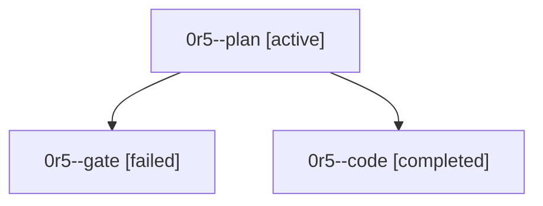

# Family: 0r5

[Agent Hoods](../README.md) / [bbugyi200](../users/bbugyi200/README.md) / [athena](../users/bbugyi200/machines/athena/README.md) / [0r5](../users/bbugyi200/machines/athena/hoods/0r5/README.md) / 0r5

Owner: `bbugyi200.athena` · Hood: `0r5` · Members: 3

## Lineage

The diagram is an optional enhancement; the ordered table below contains the same lineage in accessible text.

| Role | Agent | State | Model / provider | Timing | Commits | Prompt | Chat |
|---|---|---|---|---|---:|---|---|
| plan | 0r5--plan | active | gpt-5.6-sol / codex | 2026-09-24T18:22:47.204560+00:00 | 0 | [Prompt](../agents/bbugyi200.athena.0r5--plan/prompt.md) | [Chat](../agents/bbugyi200.athena.0r5--plan/chat.md) |
| gate | 0r5--gate | failed | gpt-5.6-sol / codex | 2026-09-24T18:27:51.015389+00:00 → 2026-09-24T18:28:15.912867+00:00 | 0 | — | [Chat](../agents/bbugyi200.athena.0r5--gate/chat.md) |
| code | 0r5--code | completed | gpt-5.6-terra / codex | 2026-09-24T18:28:58.654258+00:00 → 2026-09-24T18:41:19.893073+00:00 | [1](../agents/bbugyi200.athena.0r5--code/README.md#commits) | — | [Chat](../agents/bbugyi200.athena.0r5--code/chat.md) |

## Commits

| Role | Repo | Commit | Subject | Committed |
|---|---|---|---|---|
| code | sase | [`307da2d`](https://github.com/sase-org/sase/commit/307da2dacc1c5cfaf37c15cc69e4d60f1adf02fc) | feat(ace): accept completion menus with ctrl-f | 2026-09-24 14:36:46 EDT |
