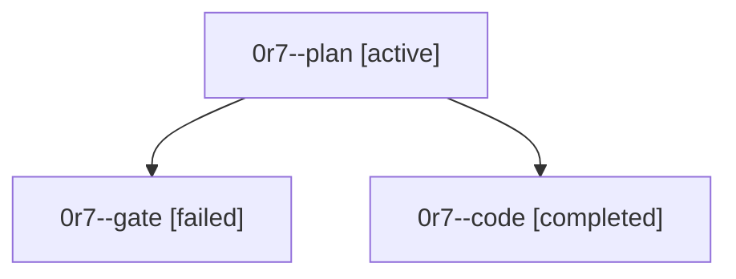

# Family: 0r7

[Agent Hoods](../README.md) / [bbugyi200](../users/bbugyi200/README.md) / [athena](../users/bbugyi200/machines/athena/README.md) / [0r7](../users/bbugyi200/machines/athena/hoods/0r7/README.md) / 0r7

Owner: `bbugyi200.athena` · Hood: `0r7` · Members: 3

## Lineage

The diagram is an optional enhancement; the ordered table below contains the same lineage in accessible text.

| Role | Agent | State | Model / provider | Timing | Commits | Prompt | Chat |
|---|---|---|---|---|---:|---|---|
| plan | 0r7--plan | active | opus / claude | 2026-09-24T19:04:44.913380+00:00 | 0 | [Prompt](../agents/bbugyi200.athena.0r7--plan/prompt.md) | [Chat](../agents/bbugyi200.athena.0r7--plan/chat.md) |
| gate | 0r7--gate | failed | opus / claude | 2026-09-24T19:14:04.013468+00:00 → 2026-09-24T19:17:48.222991+00:00 | 0 | — | [Chat](../agents/bbugyi200.athena.0r7--gate/chat.md) |
| code | 0r7--code | completed | muse-spark-1.3-contributor / muse | 2026-09-24T19:26:00.901812+00:00 → 2026-09-24T19:53:22.170123+00:00 | [1](../agents/bbugyi200.athena.0r7--code/README.md#commits) | [Prompt](../agents/bbugyi200.athena.0r7--code/prompt.md) | [Chat](../agents/bbugyi200.athena.0r7--code/chat.md) |

## Commits

| Role | Repo | Commit | Subject | Committed |
|---|---|---|---|---|
| code | sase | [`7f736de`](https://github.com/sase-org/sase/commit/7f736de0d060b89bee33ce8e6320e006795d4978) | fix(wait): isolate per-waiter failures in wait\_checks and surface runner fallback errors | 2026-09-24 15:49:57 EDT |
