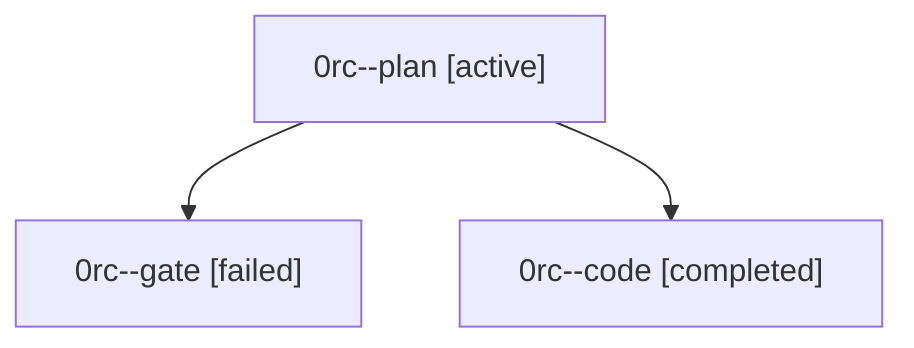

# Family: 0rc

[Agent Hoods](../README.md) / [bbugyi200](../users/bbugyi200/README.md) / [athena](../users/bbugyi200/machines/athena/README.md) / [0rc](../users/bbugyi200/machines/athena/hoods/0rc/README.md) / 0rc

Owner: `bbugyi200.athena` · Hood: `0rc` · Members: 3

## Lineage

The diagram is an optional enhancement; the ordered table below contains the same lineage in accessible text.

| Role | Agent | State | Model / provider | Timing | Commits | Prompt | Chat |
|---|---|---|---|---|---:|---|---|
| plan | 0rc--plan | active | opus / claude | 2026-09-24T20:08:52.941223+00:00 | 0 | [Prompt](../agents/bbugyi200.athena.0rc--plan/prompt.md) | [Chat](../agents/bbugyi200.athena.0rc--plan/chat.md) |
| gate | 0rc--gate | failed | opus / claude | 2026-09-24T20:13:04.596565+00:00 → 2026-09-24T20:13:23.958460+00:00 | 0 | — | [Chat](../agents/bbugyi200.athena.0rc--gate/chat.md) |
| code | 0rc--code | completed | sonnet / claude | 2026-09-24T20:13:37.008507+00:00 → 2026-09-24T20:21:06.736495+00:00 | [1](../agents/bbugyi200.athena.0rc--code/README.md#commits) | — | [Chat](../agents/bbugyi200.athena.0rc--code/chat.md) |

## Commits

| Role | Repo | Commit | Subject | Committed |
|---|---|---|---|---|
| code | sase | [`740c08f`](https://github.com/sase-org/sase/commit/740c08f6183175ec46b6d2fdbfbfe229ae16f22a) | feat(ace): open effort completion on @ after %m:\<model\> space | 2026-09-24 16:19:55 EDT |
