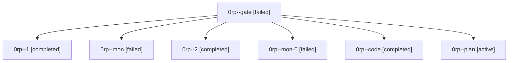

# Family: 0rp

[Agent Hoods](../README.md) / [bbugyi200](../users/bbugyi200/README.md) / [athena](../users/bbugyi200/machines/athena/README.md) / [0rp](../users/bbugyi200/machines/athena/hoods/0rp/README.md) / 0rp

Owner: `bbugyi200.athena` · Hood: `0rp` · Members: 7

## Lineage

The diagram is an optional enhancement; the ordered table below contains the same lineage in accessible text.

| Role | Agent | State | Model / provider | Timing | Commits | Prompt | Chat |
|---|---|---|---|---|---:|---|---|
| gate | 0rp--gate | failed | opus / claude | 2026-09-24T22:29:41.921054+00:00 → 2026-09-24T22:34:42.520664+00:00 | 0 | — | [Chat](../agents/bbugyi200.athena.0rp--gate/chat.md) |
| 1 | 0rp--1 | completed | gpt-5.6-terra / codex | 2026-09-24T23:37:44.779124+00:00 → 2026-09-24T23:39:39.761636+00:00 | 0 | [Prompt](../agents/bbugyi200.athena.0rp--1/prompt.md) | [Chat](../agents/bbugyi200.athena.0rp--1/chat.md) |
| mon | 0rp--mon | failed | gpt-5.6-terra / codex | 2026-09-24T23:04:45.959229+00:00 → 2026-09-24T23:12:38.387171+00:00 | 0 | — | [Chat](../agents/bbugyi200.athena.0rp--mon/chat.md) |
| 2 | 0rp--2 | completed | sonnet / claude | 2026-09-25T00:27:19.710807+00:00 → 2026-09-25T00:32:22.157750+00:00 | [1](../agents/bbugyi200.athena.0rp--2/README.md#commits) | [Prompt](../agents/bbugyi200.athena.0rp--2/prompt.md) | [Chat](../agents/bbugyi200.athena.0rp--2/chat.md) |
| mon-0 | 0rp--mon-0 | failed | gpt-5.6-terra / codex | 2026-09-24T23:39:14.783593+00:00 → 2026-09-25T00:21:05.906855+00:00 | 0 | — | [Chat](../agents/bbugyi200.athena.0rp--mon-0/chat.md) |
| code | 0rp--code | completed | gpt-5.6-terra / codex | 2026-09-24T23:00:48.824198+00:00 → 2026-09-24T23:05:10.254266+00:00 | 0 | [Prompt](../agents/bbugyi200.athena.0rp--code/prompt.md) | [Chat](../agents/bbugyi200.athena.0rp--code/chat.md) |
| plan | 0rp--plan | active | opus / claude | 2026-09-24T22:27:16.656841+00:00 | 0 | [Prompt](../agents/bbugyi200.athena.0rp--plan/prompt.md) | [Chat](../agents/bbugyi200.athena.0rp--plan/chat.md) |

## Commits

| Role | Repo | Commit | Subject | Committed |
|---|---|---|---|---|
| 2 | sase | [`951ff0a`](https://github.com/sase-org/sase/commit/951ff0a102256a591fa3240f14ec88e39419b125) | feat(just): drop toobig from check and check-full | 2026-09-24 20:29:24 EDT |
