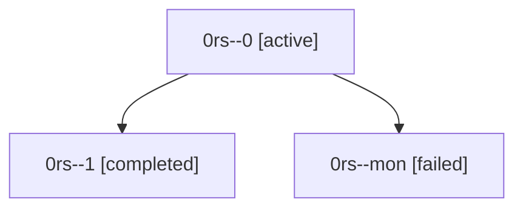

# Family: 0rs

[Agent Hoods](../README.md) / [bbugyi200](../users/bbugyi200/README.md) / [athena](../users/bbugyi200/machines/athena/README.md) / [0rs](../users/bbugyi200/machines/athena/hoods/0rs/README.md) / 0rs

Owner: `bbugyi200.athena` · Hood: `0rs` · Members: 3

## Lineage

The diagram is an optional enhancement; the ordered table below contains the same lineage in accessible text.

| Role | Agent | State | Model / provider | Timing | Commits | Prompt | Chat |
|---|---|---|---|---|---:|---|---|
| 0 | 0rs--0 | active | gpt-5.6-terra / codex | 2026-09-24T22:55:45.694885+00:00 | 0 | [Prompt](../agents/bbugyi200.athena.0rs--0/prompt.md) | [Chat](../agents/bbugyi200.athena.0rs--0/chat.md) |
| 1 | 0rs--1 | completed | gpt-5.6-terra / codex | 2026-09-24T23:38:31.045846+00:00 → 2026-09-24T23:43:38.744814+00:00 | [1](../agents/bbugyi200.athena.0rs--1/README.md#commits) | [Prompt](../agents/bbugyi200.athena.0rs--1/prompt.md) | [Chat](../agents/bbugyi200.athena.0rs--1/chat.md) |
| mon | 0rs--mon | failed | gpt-5.6-terra / codex | 2026-09-24T23:03:35.916636+00:00 → 2026-09-24T23:12:28.722805+00:00 | 0 | — | [Chat](../agents/bbugyi200.athena.0rs--mon/chat.md) |

## Commits

| Role | Repo | Commit | Subject | Committed |
|---|---|---|---|---|
| 1 | sase | [`0d7229b`](https://github.com/sase-org/sase/commit/0d7229bef1400d66845279d68e5c63d748906218) | feat(ace): allow forking finished planner agents | 2026-09-24 19:40:53 EDT |
