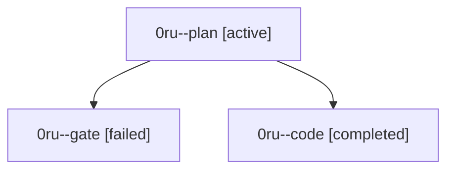

# Family: 0ru

[Agent Hoods](../README.md) / [bbugyi200](../users/bbugyi200/README.md) / [athena](../users/bbugyi200/machines/athena/README.md) / [0ru](../users/bbugyi200/machines/athena/hoods/0ru/README.md) / 0ru

Owner: `bbugyi200.athena` · Hood: `0ru` · Members: 3

## Lineage

The diagram is an optional enhancement; the ordered table below contains the same lineage in accessible text.

| Role | Agent | State | Model / provider | Timing | Commits | Prompt | Chat |
|---|---|---|---|---|---:|---|---|
| plan | 0ru--plan | active | opus / claude | 2026-09-24T23:11:24.118630+00:00 | 0 | [Prompt](../agents/bbugyi200.athena.0ru--plan/prompt.md) | [Chat](../agents/bbugyi200.athena.0ru--plan/chat.md) |
| gate | 0ru--gate | failed | opus / claude | 2026-09-24T23:55:31.867516+00:00 → 2026-09-24T23:57:11.761980+00:00 | 0 | — | [Chat](../agents/bbugyi200.athena.0ru--gate/chat.md) |
| code | 0ru--code | completed | sonnet / claude | 2026-09-24T23:57:33.053070+00:00 → 2026-09-25T02:58:08.158904+00:00 | [1](../agents/bbugyi200.athena.0ru--code/README.md#commits) | — | [Chat](../agents/bbugyi200.athena.0ru--code/chat.md) |

## Commits

| Role | Repo | Commit | Subject | Committed |
|---|---|---|---|---|
| code | sase | [`a674dc9`](https://github.com/sase-org/sase/commit/a674dc91f186c653399a681f97d456876edbcb19) | test(ace): finish the deck cutover's visual migration and chrome fixes (sase-17d.10.1.4) | 2026-09-24 22:50:42 EDT |
