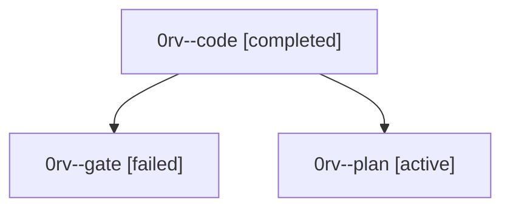

# Family: 0rv

[Agent Hoods](../README.md) / [bbugyi200](../users/bbugyi200/README.md) / [athena](../users/bbugyi200/machines/athena/README.md) / [0rv](../users/bbugyi200/machines/athena/hoods/0rv/README.md) / 0rv

Owner: `bbugyi200.athena` · Hood: `0rv` · Members: 3

## Lineage

The diagram is an optional enhancement; the ordered table below contains the same lineage in accessible text.

| Role | Agent | State | Model / provider | Timing | Commits | Prompt | Chat |
|---|---|---|---|---|---:|---|---|
| code | 0rv--code | completed | muse-spark-1.3-contributor / muse | 2026-09-25T10:46:48.490382+00:00 → 2026-09-25T11:12:48.221945+00:00 | [1](../agents/bbugyi200.athena.0rv--code/README.md#commits) | — | [Chat](../agents/bbugyi200.athena.0rv--code/chat.md) |
| gate | 0rv--gate | failed | opus / claude | 2026-09-25T10:46:09.566281+00:00 → 2026-09-25T10:46:27.959019+00:00 | 0 | — | [Chat](../agents/bbugyi200.athena.0rv--gate/chat.md) |
| plan | 0rv--plan | active | opus / claude | 2026-09-25T10:42:11.451092+00:00 | 0 | [Prompt](../agents/bbugyi200.athena.0rv--plan/prompt.md) | [Chat](../agents/bbugyi200.athena.0rv--plan/chat.md) |

## Commits

| Role | Repo | Commit | Subject | Committed |
|---|---|---|---|---|
| code | sase | [`4fb63b0`](https://github.com/sase-org/sase/commit/4fb63b05a1e79e157fc1aac8463ebd1a9850ddad) | feat(ace-tui): label header usage cluster with dim usage: prefix | 2026-09-25 07:09:10 EDT |

## Neighbors

| Agent | Relation | State |
|---|---|---|
| [0rv.w0](bbugyi200.athena.0rv.w0.md) (family · 7) | descendant | active 1, completed 3, failed 3 |
| [0rv.w0.f0](bbugyi200.athena.0rv.w0.f0.md) (family · 3) | descendant | completed 1, failed 1, waiting 1 |
| [0rv.w0.f0.w0](../agents/bbugyi200.athena.0rv.w0.f0.w0/README.md) | descendant | waiting |
