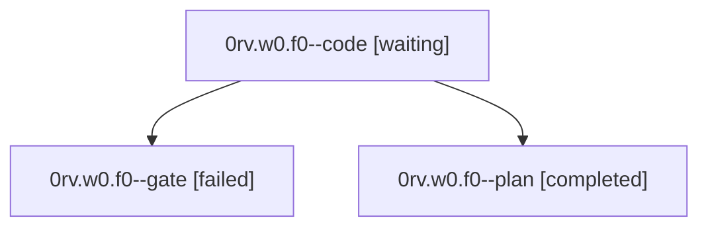

# Family: 0rv.w0.f0

[Agent Hoods](../README.md) / [bbugyi200](../users/bbugyi200/README.md) / [athena](../users/bbugyi200/machines/athena/README.md) / [0rv](../users/bbugyi200/machines/athena/hoods/0rv/README.md) / 0rv.w0.f0

Owner: `bbugyi200.athena` · Hood: `0rv` · Members: 3

## Lineage

The diagram is an optional enhancement; the ordered table below contains the same lineage in accessible text.

| Role | Agent | State | Model / provider | Timing | Commits | Prompt | Chat |
|---|---|---|---|---|---:|---|---|
| code | 0rv.w0.f0--code | waiting | sonnet / claude | 20260925102652 | 0 | [Prompt](../agents/bbugyi200.athena.0rv.w0.f0--code/prompt.md) | — |
| gate | 0rv.w0.f0--gate | failed | opus / claude | 2026-09-25T14:21:27.726769+00:00 → 2026-09-25T14:26:52.807056+00:00 | 0 | — | [Chat](../agents/bbugyi200.athena.0rv.w0.f0--gate/chat.md) |
| plan | 0rv.w0.f0--plan | completed | opus / claude | 2026-09-25T14:16:12.673459+00:00 → 2026-09-25T14:22:50.393391+00:00 | 0 | [Prompt](../agents/bbugyi200.athena.0rv.w0.f0--plan/prompt.md) | [Chat](../agents/bbugyi200.athena.0rv.w0.f0--plan/chat.md) |

## Neighbors

| Agent | Relation | State |
|---|---|---|
| [0rv.w0](bbugyi200.athena.0rv.w0.md) (family · 7) | ancestor | active 1, completed 3, failed 3 |
| [0rv](bbugyi200.athena.0rv.md) (family · 3) | ancestor | active 1, completed 1, failed 1 |
| [0rv.w0.f0.w0](../agents/bbugyi200.athena.0rv.w0.f0.w0/README.md) | descendant | waiting |
