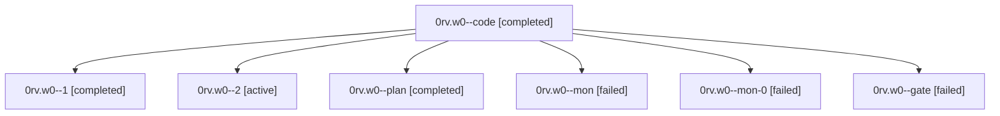

# Family: 0rv.w0

[Agent Hoods](../README.md) / [bbugyi200](../users/bbugyi200/README.md) / [athena](../users/bbugyi200/machines/athena/README.md) / [0rv](../users/bbugyi200/machines/athena/hoods/0rv/README.md) / 0rv.w0

Owner: `bbugyi200.athena` · Hood: `0rv` · Members: 7

## Lineage

The diagram is an optional enhancement; the ordered table below contains the same lineage in accessible text.

| Role | Agent | State | Model / provider | Timing | Commits | Prompt | Chat |
|---|---|---|---|---|---:|---|---|
| code | 0rv.w0--code | completed | sonnet / claude | 2026-09-25T11:24:06.562842+00:00 → 2026-09-25T12:29:37.362154+00:00 | 0 | [Prompt](../agents/bbugyi200.athena.0rv.w0--code/prompt.md) | [Chat](../agents/bbugyi200.athena.0rv.w0--code/chat.md) |
| 1 | 0rv.w0--1 | completed | sonnet / claude | 2026-09-25T14:03:07.234101+00:00 → 2026-09-25T14:34:10.897640+00:00 | 0 | [Prompt](../agents/bbugyi200.athena.0rv.w0--1/prompt.md) | [Chat](../agents/bbugyi200.athena.0rv.w0--1/chat.md) |
| 2 | 0rv.w0--2 | active | sonnet / claude | 2026-09-25T15:34:06.033831+00:00 | 0 | [Prompt](../agents/bbugyi200.athena.0rv.w0--2/prompt.md) | — |
| plan | 0rv.w0--plan | completed | opus / claude | 2026-09-25T11:12:12.477138+00:00 → 2026-09-25T11:22:07.018669+00:00 | 0 | [Prompt](../agents/bbugyi200.athena.0rv.w0--plan/prompt.md) | [Chat](../agents/bbugyi200.athena.0rv.w0--plan/chat.md) |
| mon | 0rv.w0--mon | failed | sonnet / claude | 2026-09-25T12:27:25.679404+00:00 → 2026-09-25T13:47:01.217445+00:00 | 0 | — | [Chat](../agents/bbugyi200.athena.0rv.w0--mon/chat.md) |
| mon-0 | 0rv.w0--mon-0 | failed | sonnet / claude | 2026-09-25T14:31:37.168347+00:00 → 2026-09-25T15:24:54.530245+00:00 | 0 | — | [Chat](../agents/bbugyi200.athena.0rv.w0--mon-0/chat.md) |
| gate | 0rv.w0--gate | failed | opus / claude | 2026-09-25T11:22:49.620118+00:00 → 2026-09-25T11:23:44.284577+00:00 | 0 | — | [Chat](../agents/bbugyi200.athena.0rv.w0--gate/chat.md) |

## Neighbors

| Agent | Relation | State |
|---|---|---|
| [0rv](bbugyi200.athena.0rv.md) (family · 3) | ancestor | active 1, completed 1, failed 1 |
| [0rv.w0.f0](bbugyi200.athena.0rv.w0.f0.md) (family · 3) | descendant | completed 1, failed 1, waiting 1 |
| [0rv.w0.f0.w0](../agents/bbugyi200.athena.0rv.w0.f0.w0/README.md) | descendant | waiting |
