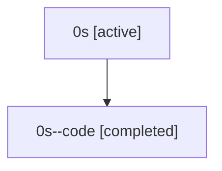

# Family: 0s

[Agent Hoods](../README.md) / [bbugyi200](../users/bbugyi200/README.md) / [athena](../users/bbugyi200/machines/athena/README.md) / [0s](../users/bbugyi200/machines/athena/hoods/0s/README.md) / 0s

Owner: `bbugyi200.athena` · Hood: `0s` · Members: 2

## Lineage

The diagram is an optional enhancement; the ordered table below contains the same lineage in accessible text.

| Role | Agent | State | Model / provider | Timing | Commits | Prompt | Chat |
|---|---|---|---|---|---:|---|---|
| root | 0s | active | gpt-5.5 / codex | 2026-07-07T18:21:30.301022+00:00 | [3](../agents/bbugyi200.athena.0s/README.md#commits) | [Prompt](../agents/bbugyi200.athena.0s/prompt.md) | [Chat](../agents/bbugyi200.athena.0s/chat.md) |
| code | 0s--code | completed | gpt-5.5 / codex | 2026-07-07T18:24:35.297494+00:00 | 0 | — | [Chat](../agents/bbugyi200.athena.0s--code/chat.md) |

## Commits

| Role | Repo | Commit | Subject | Committed |
|---|---|---|---|---|
| root | sase | [`d57cf2a`](https://github.com/sase-org/sase/commit/d57cf2ab941b131019a84ed9c06babbb1fdd2b15) | chore: Add SDD prompt and plan for agents\_var\_namespace | 2026-06-03 01:23:03 EDT |
| root | sase | [`0b84b94`](https://github.com/sase-org/sase/commit/0b84b94fca438557844b88154ad5df40c5644c95) | chore: Add SDD prompt and plan for update\_confirm\_commits | 2026-07-07 14:24:34 EDT |
| root | sase | [`9c9caa6`](https://github.com/sase-org/sase/commit/9c9caa6cc99b733f3605799b4ffd38d9c07c18e4) | fix(tui): summarize multi-repo update commits | 2026-07-07 14:33:43 EDT |
