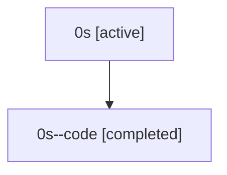

# Family: 0s

Owner: `bbugyi200.athena` · Hood: `0s` · Members: 2

## Lineage

The diagram is an optional enhancement; the ordered table below contains the same lineage in accessible text.

| Role | Agent | State | Model / provider | Timing | Commits | Prompt | Chat |
|---|---|---|---|---|---:|---|---|
| root | 0s | active | gpt-5.5 / codex | 2026-07-07T18:21:30.301022+00:00 | 3 | [Prompt](../agents/bbugyi200.athena.0s/prompt.md) | [Chat](../agents/bbugyi200.athena.0s/chat.md) |
| code | 0s--code | completed | gpt-5.5 / codex | 2026-07-07T18:24:35.297494+00:00 | 0 | — | [Chat](../agents/bbugyi200.athena.0s--code/chat.md) |
