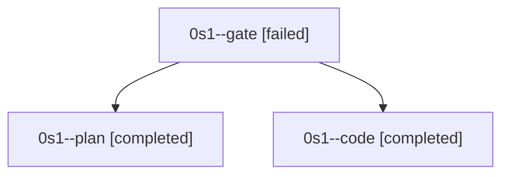

# Family: 0s1

[Agent Hoods](../README.md) / [bbugyi200](../users/bbugyi200/README.md) / [athena](../users/bbugyi200/machines/athena/README.md) / [0s1](../users/bbugyi200/machines/athena/hoods/0s1/README.md) / 0s1

Owner: `bbugyi200.athena` · Hood: `0s1` · Members: 3

## Lineage

The diagram is an optional enhancement; the ordered table below contains the same lineage in accessible text.

| Role | Agent | State | Model / provider | Timing | Commits | Prompt | Chat |
|---|---|---|---|---|---:|---|---|
| gate | 0s1--gate | failed | opus / claude | 2026-09-25T13:11:06.394422+00:00 → 2026-09-25T13:18:46.505341+00:00 | 0 | — | [Chat](../agents/bbugyi200.athena.0s1--gate/chat.md) |
| plan | 0s1--plan | completed | opus / claude | 2026-09-25T12:59:55.284699+00:00 → 2026-09-25T13:12:57.583341+00:00 | 0 | [Prompt](../agents/bbugyi200.athena.0s1--plan/prompt.md) | [Chat](../agents/bbugyi200.athena.0s1--plan/chat.md) |
| code | 0s1--code | completed | muse-spark-1.3-contributor / muse | 2026-09-25T13:31:21.423960+00:00 → 2026-09-25T14:00:56.374182+00:00 | [1](../agents/bbugyi200.athena.0s1--code/README.md#commits) | [Prompt](../agents/bbugyi200.athena.0s1--code/prompt.md) | [Chat](../agents/bbugyi200.athena.0s1--code/chat.md) |

## Commits

| Role | Repo | Commit | Subject | Committed |
|---|---|---|---|---|
| code | sase | [`1523580`](https://github.com/sase-org/sase/commit/1523580bc659fd1b74efc742dc8aab7ad9637feb) | fix(ace): quiet false Services unhealthy toast after update-driven restart | 2026-09-25 09:56:12 EDT |
