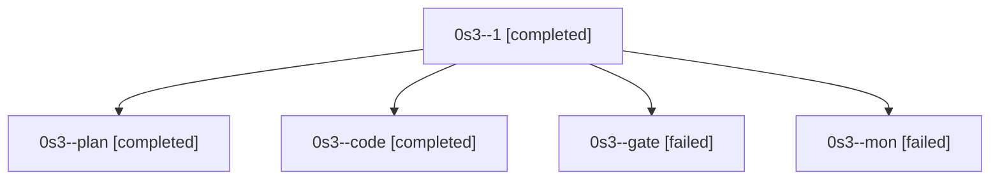

# Family: 0s3

[Agent Hoods](../README.md) / [bbugyi200](../users/bbugyi200/README.md) / [athena](../users/bbugyi200/machines/athena/README.md) / [0s3](../users/bbugyi200/machines/athena/hoods/0s3/README.md) / 0s3

Owner: `bbugyi200.athena` · Hood: `0s3` · Members: 5

## Lineage

The diagram is an optional enhancement; the ordered table below contains the same lineage in accessible text.

| Role | Agent | State | Model / provider | Timing | Commits | Prompt | Chat |
|---|---|---|---|---|---:|---|---|
| 1 | 0s3--1 | completed | muse-spark-1.3-contributor / muse | 2026-09-25T15:40:20.530477+00:00 → 2026-09-25T15:58:48.010145+00:00 | [1](../agents/bbugyi200.athena.0s3--1/README.md#commits) | [Prompt](../agents/bbugyi200.athena.0s3--1/prompt.md) | [Chat](../agents/bbugyi200.athena.0s3--1/chat.md) |
| plan | 0s3--plan | completed | opus / claude | 2026-09-25T14:38:17.667660+00:00 → 2026-09-25T14:57:46.398971+00:00 | 0 | [Prompt](../agents/bbugyi200.athena.0s3--plan/prompt.md) | [Chat](../agents/bbugyi200.athena.0s3--plan/chat.md) |
| code | 0s3--code | completed | muse-spark-1.3-contributor / muse | 2026-09-25T15:13:38.013948+00:00 → 2026-09-25T15:27:12.694697+00:00 | 0 | [Prompt](../agents/bbugyi200.athena.0s3--code/prompt.md) | [Chat](../agents/bbugyi200.athena.0s3--code/chat.md) |
| gate | 0s3--gate | failed | opus / claude | 2026-09-25T14:57:05.573300+00:00 → 2026-09-25T15:04:31.548308+00:00 | 0 | — | [Chat](../agents/bbugyi200.athena.0s3--gate/chat.md) |
| mon | 0s3--mon | failed | muse-spark-1.3-contributor / muse | 2026-09-25T15:25:13.328817+00:00 → 2026-09-25T15:37:46.522010+00:00 | 0 | — | [Chat](../agents/bbugyi200.athena.0s3--mon/chat.md) |

## Commits

| Role | Repo | Commit | Subject | Committed |
|---|---|---|---|---|
| 1 | sase | [`fdbc47b`](https://github.com/sase-org/sase/commit/fdbc47b51aac9a7180c9f7cd2f1c30321f5f7467) | fix(fork-waits): keep session fork waits blocked while a successor is slot-queued | 2026-09-25 11:51:15 EDT |
