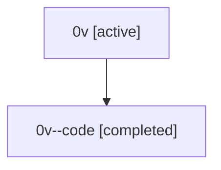

# Family: 0v

Owner: `bbugyi200.athena` · Hood: `0v` · Members: 2

## Lineage

The diagram is an optional enhancement; the ordered table below contains the same lineage in accessible text.

| Role | Agent | State | Model / provider | Timing | Commits | Prompt | Chat |
|---|---|---|---|---|---:|---|---|
| root | 0v | active | gpt-5.5 / codex | 2026-07-07T19:49:45.335858+00:00 | 4 | [Prompt](../agents/bbugyi200.athena.0v/prompt.md) | [Chat](../agents/bbugyi200.athena.0v/chat.md) |
| code | 0v--code | completed | gpt-5.5 / codex | 2026-07-07T19:52:31.893198+00:00 | 0 | — | [Chat](../agents/bbugyi200.athena.0v--code/chat.md) |
