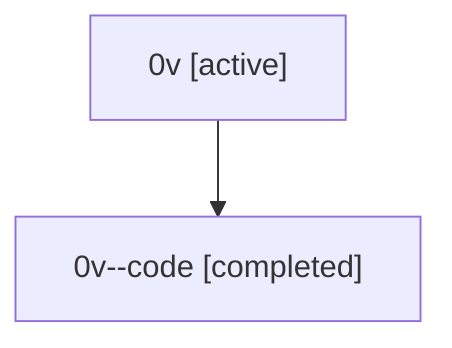

# Family: 0v

[Agent Hoods](../README.md) / [bbugyi200](../users/bbugyi200/README.md) / [athena](../users/bbugyi200/machines/athena/README.md) / [0v](../users/bbugyi200/machines/athena/hoods/0v/README.md) / 0v

Owner: `bbugyi200.athena` · Hood: `0v` · Members: 2

## Lineage

The diagram is an optional enhancement; the ordered table below contains the same lineage in accessible text.

| Role | Agent | State | Model / provider | Timing | Commits | Prompt | Chat |
|---|---|---|---|---|---:|---|---|
| root | 0v | active | gpt-5.5 / codex | 2026-07-07T19:49:45.335858+00:00 | [4](../agents/bbugyi200.athena.0v/README.md#commits) | [Prompt](../agents/bbugyi200.athena.0v/prompt.md) | [Chat](../agents/bbugyi200.athena.0v/chat.md) |
| code | 0v--code | completed | gpt-5.5 / codex | 2026-07-07T19:52:31.893198+00:00 | 0 | — | [Chat](../agents/bbugyi200.athena.0v--code/chat.md) |

## Commits

| Role | Repo | Commit | Subject | Committed (UTC) |
|---|---|---|---|---|
| root | sase | [`03692ad`](https://github.com/sase-org/sase/commit/03692ad7ae33ae1604a557eb65ca7af323d1e598) | chore: Add SDD prompt and plan for agents\_var\_namespace\_1 | 2026-06-03 05:31:59 |
| root | sase | [`6950b5c`](https://github.com/sase-org/sase/commit/6950b5c36bd258b19df396fb04adab598777dfc6) | feat: expose sase var output variables under single \`agents\` dict | 2026-06-03 05:49:25 |
| root | sase | [`9d72768`](https://github.com/sase-org/sase/commit/9d72768cb56c9293fda4a2a985f1afcd25360654) | chore: Add SDD prompt and plan for epic\_work\_auto\_tale | 2026-07-07 19:52:30 |
| root | sase | [`64728c4`](https://github.com/sase-org/sase/commit/64728c413a9b1083f01f8ac5f66579a28f125253) | fix(bead): use tale auto-approval for epic work | 2026-07-07 20:00:02 |
