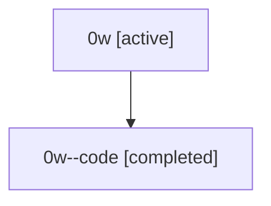

# Family: 0w

[Agent Hoods](../README.md) / [bbugyi200](../users/bbugyi200/README.md) / [athena](../users/bbugyi200/machines/athena/README.md) / [0w](../users/bbugyi200/machines/athena/hoods/0w/README.md) / 0w

Owner: `bbugyi200.athena` · Hood: `0w` · Members: 2

## Lineage

The diagram is an optional enhancement; the ordered table below contains the same lineage in accessible text.

| Role | Agent | State | Model / provider | Timing | Commits | Prompt | Chat |
|---|---|---|---|---|---:|---|---|
| root | 0w | active | claude-fable-5 / claude | 2026-07-07T19:54:36.884522+00:00 | [4](../agents/bbugyi200.athena.0w/README.md#commits) | [Prompt](../agents/bbugyi200.athena.0w/prompt.md) | [Chat](../agents/bbugyi200.athena.0w/chat.md) |
| code | 0w--code | completed | gpt-5.5 / codex | 2026-07-07T20:04:44.815178+00:00 | [1](../agents/bbugyi200.athena.0w--code/README.md#commits) | — | [Chat](../agents/bbugyi200.athena.0w--code/chat.md) |

## Commits

| Role | Commit | Subject | Committed (UTC) |
|---|---|---|---|
| root | [`d3c37c5`](https://github.com/sase-org/sase/commit/d3c37c5b11f46381ad94f127a9ec6edbf3ff52e7) | chore: Add SDD prompt and plan for codex\_transient\_retry | 2026-06-03 05:40:52 |
| root | [`0ceb65c`](https://github.com/sase-org/sase/commit/0ceb65c27949090bc57a79f5f1c9e8d24201e855) | feat: Add built-in transient-failure retry coverage for the Codex provider | 2026-06-03 06:24:56 |
| root | [`cd2be5d`](https://github.com/sase-org/sase/commit/cd2be5d63981331fbaaa87e864cd6fe06ab66f0d) | chore: Add SDD prompt and plan for gh\_ref\_tui\_credential\_freeze | 2026-07-07 20:04:43 |
| code | [`77d9330`](https://github.com/sase-org/sase/commit/77d933029cf8d4027fe4eefab6af4219f7b5c784) | fix: avoid credential prompts during ref completion | 2026-07-07 20:25:09 |
| root | [`77d9330`](https://github.com/sase-org/sase/commit/77d933029cf8d4027fe4eefab6af4219f7b5c784) | fix: avoid credential prompts during ref completion | 2026-07-07 20:25:09 |
