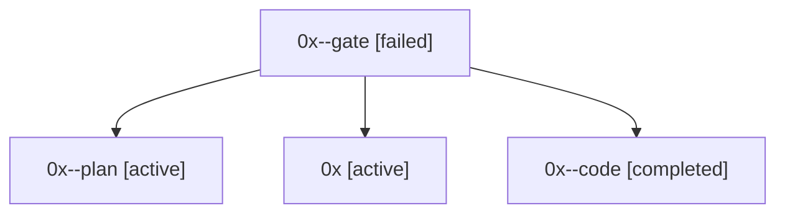

# Family: 0x

[Agent Hoods](../README.md) / [bbugyi200](../users/bbugyi200/README.md) / [athena](../users/bbugyi200/machines/athena/README.md) / [0x](../users/bbugyi200/machines/athena/hoods/0x/README.md) / 0x

Owner: `bbugyi200.athena` · Hood: `0x` · Members: 4

## Lineage

The diagram is an optional enhancement; the ordered table below contains the same lineage in accessible text.

| Role | Agent | State | Model / provider | Timing | Commits | Prompt | Chat |
|---|---|---|---|---|---:|---|---|
| gate | 0x--gate | failed | opus / claude | 2026-09-13T11:04:42.800710+00:00 → 2026-09-13T11:05:05.200463+00:00 | 0 | — | [Chat](../agents/bbugyi200.athena.0x--gate/chat.md) |
| plan | 0x--plan | active | opus / claude | 2026-09-13T10:59:03.708846+00:00 | 0 | [Prompt](../agents/bbugyi200.athena.0x--plan/prompt.md) | [Chat](../agents/bbugyi200.athena.0x--plan/chat.md) |
| root | 0x | active | claude-fable-5 / claude | 2026-07-07T20:00:30.288275+00:00 | [1](../agents/bbugyi200.athena.0x/README.md#commits) | [Prompt](../agents/bbugyi200.athena.0x/prompt.md) | [Chat](../agents/bbugyi200.athena.0x/chat.md) |
| code | 0x--code | completed | gpt-5.5 / codex | 2026-07-07T20:12:25.489411+00:00 | [1](../agents/bbugyi200.athena.0x--code/README.md#commits) | — | [Chat](../agents/bbugyi200.athena.0x--code/chat.md) |

## Commits

| Role | Repo | Commit | Subject | Committed |
|---|---|---|---|---|
| root | sase | [`687eb05`](https://github.com/sase-org/sase/commit/687eb0556c74cd7ed8213809dedb3cb68b41b74d) | chore: Add SDD prompt and plan for tools\_panel\_detail\_levels | 2026-07-07 16:12:24 EDT |
| code | sase | [`9aface2`](https://github.com/sase-org/sase/commit/9aface2c9ce9caca5e3a178bcd8b340442c606a9) | feat(tui): add tools panel detail levels | 2026-07-07 16:32:12 EDT |

## Neighbors

| Agent | Relation | State |
|---|---|---|
| [0x.cld](../agents/bbugyi200.athena.0x.cld/README.md) | descendant | completed |
