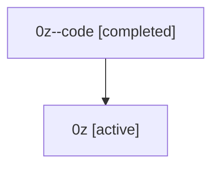

# Family: 0z

[Agent Hoods](../README.md) / [bbugyi200](../users/bbugyi200/README.md) / [athena](../users/bbugyi200/machines/athena/README.md) / [0z](../users/bbugyi200/machines/athena/hoods/0z/README.md) / 0z

Owner: `bbugyi200.athena` · Hood: `0z` · Members: 2

## Lineage

The diagram is an optional enhancement; the ordered table below contains the same lineage in accessible text.

| Role | Agent | State | Model / provider | Timing | Commits | Prompt | Chat |
|---|---|---|---|---|---:|---|---|
| code | 0z--code | completed | gpt-5.5 / codex | 2026-07-07T20:28:20.564183+00:00 | 0 | — | [Chat](../agents/bbugyi200.athena.0z--code/chat.md) |
| root | 0z | active | claude-fable-5 / claude | 2026-07-07T20:15:56.991295+00:00 | [2](../agents/bbugyi200.athena.0z/README.md#commits) | [Prompt](../agents/bbugyi200.athena.0z/prompt.md) | [Chat](../agents/bbugyi200.athena.0z/chat.md) |

## Commits

| Role | Commit | Subject | Committed (UTC) |
|---|---|---|---|
| root | [`8c26b3c`](https://github.com/sase-org/sase/commit/8c26b3c9abab86e23ced65e99e941c12e12460ba) | chore: Add SDD prompt and plan for stuck\_pending\_tool\_calls | 2026-07-07 20:28:18 |
| root | [`be54023`](https://github.com/sase-org/sase/commit/be540239c2b33730c83199d8465546e294b5f4b6) | fix: prevent stale pending tool calls | 2026-07-07 20:52:38 |

## Neighbors

| Agent | Relation | State |
|---|---|---|
| [0z.w1](bbugyi200.athena.0z.w1.md) (family · 2) | descendant | active 1, completed 1 |
| [0z.w1.f1](bbugyi200.athena.0z.w1.f1.md) (family · 2) | descendant | active 1, completed 1 |
