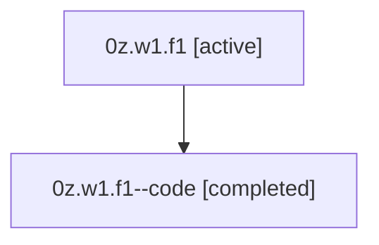

# Family: 0z.w1.f1

[Agent Hoods](../README.md) / [bbugyi200](../users/bbugyi200/README.md) / [athena](../users/bbugyi200/machines/athena/README.md) / [0z](../users/bbugyi200/machines/athena/hoods/0z/README.md) / 0z.w1.f1

Owner: `bbugyi200.athena` · Hood: `0z` · Members: 2

## Lineage

The diagram is an optional enhancement; the ordered table below contains the same lineage in accessible text.

| Role | Agent | State | Model / provider | Timing | Commits | Prompt | Chat |
|---|---|---|---|---|---:|---|---|
| root | 0z.w1.f1 | active | gpt-5.5 / codex | 2026-07-08T00:36:53.359644+00:00 | [1](../agents/bbugyi200.athena.0z.w1.f1/README.md#commits) | [Prompt](../agents/bbugyi200.athena.0z.w1.f1/prompt.md) | [Chat](../agents/bbugyi200.athena.0z.w1.f1/chat.md) |
| code | 0z.w1.f1--code | completed | gpt-5.5 / codex | 2026-07-08T00:40:40.830423+00:00 | [1](../agents/bbugyi200.athena.0z.w1.f1--code/README.md#commits) | — | [Chat](../agents/bbugyi200.athena.0z.w1.f1--code/chat.md) |

## Commits

| Role | Repo | Commit | Subject | Committed |
|---|---|---|---|---|
| root | sase | [`a85b283`](https://github.com/sase-org/sase/commit/a85b28328b9fb67a9dc72de827b869c4dec2cafd) | chore: Add SDD prompt and plan for successful\_slow\_tool\_call\_hints | 2026-07-08 00:40:38 UTC |
| code | sase | [`2d13be9`](https://github.com/sase-org/sase/commit/2d13be9ce05a93715436a755e8dcf168c98a041b) | feat(tui): add slow-tool reports for successful calls | 2026-07-08 00:51:47 UTC |

## Neighbors

| Agent | Relation | State |
|---|---|---|
| [0z.w1](bbugyi200.athena.0z.w1.md) (family · 2) | ancestor | active 1, completed 1 |
| [0z](bbugyi200.athena.0z.md) (family · 2) | ancestor | active 1, completed 1 |
