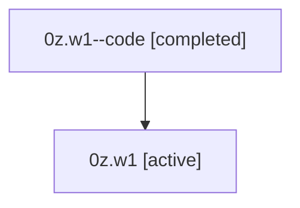

# Family: 0z.w1

Owner: `bbugyi200.athena` · Hood: `0z` · Members: 2

## Lineage

The diagram is an optional enhancement; the ordered table below contains the same lineage in accessible text.

| Role | Agent | State | Model / provider | Timing | Commits | Prompt | Chat |
|---|---|---|---|---|---:|---|---|
| code | 0z.w1--code | completed | gpt-5.5 / codex | 2026-07-07T21:06:03.662431+00:00 | 0 | — | [Chat](../agents/bbugyi200.athena.0z.w1--code/chat.md) |
| root | 0z.w1 | active | claude-fable-5 / claude | 2026-07-07T16:53:22.821174 | 2 | [Prompt](../agents/bbugyi200.athena.0z.w1/prompt.md) | [Chat](../agents/bbugyi200.athena.0z.w1/chat.md) |
